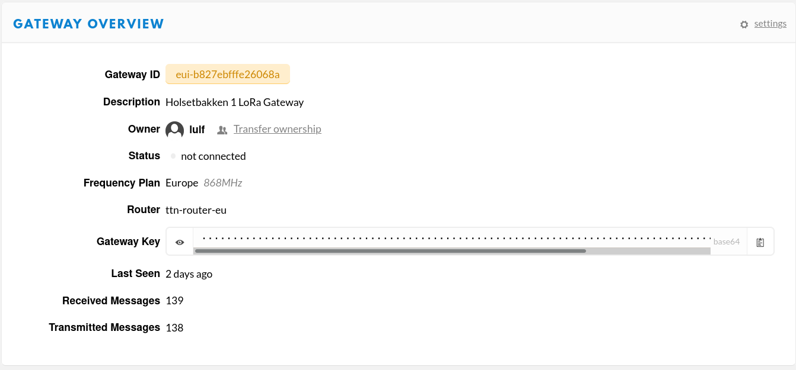
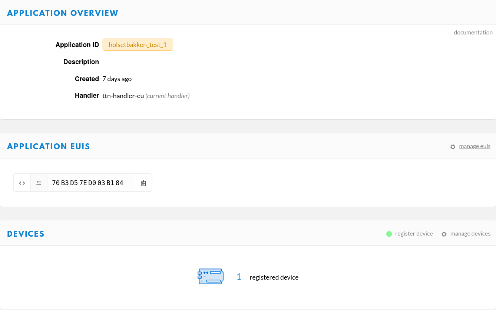
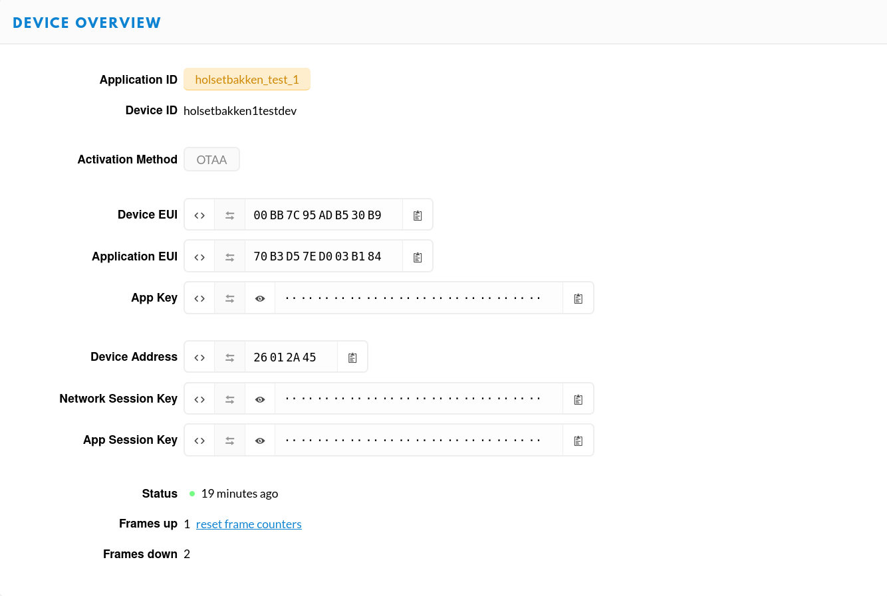
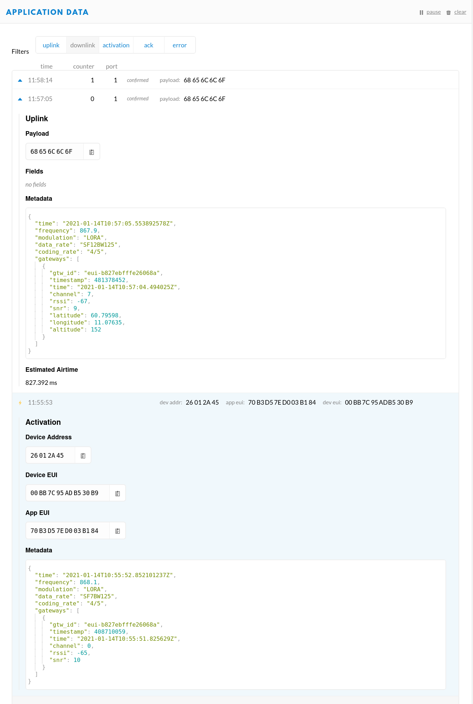

+++
title = "Rust and LoRa"
description = "LoRa is a low power long range wireless that operates in a lower frequency spectrum than WiFi, ZigBee and Bluetooth. This enables IoT use cases not possible with the shorter range technologies. And, of course you can use Rust with LoRa."
extra.author = "lulf"
+++

LoRa is a low power long range wireless protocol that operates in a lower frequency spectrum than WiFi, ZigBee and Bluetooth. This enables IoT use cases not possible with the shorter range technologies. And, you can use Rust!

<!-- more -->

In the LoRa stack, you have a LoRa node talking to LoRaWAN gateways, talking to a cloud service. Multiple LoRaWAN Gateways operate as a network, and a LoRa node can reach a gateway several kilometers away. The gateways are connected to a network server provided by companies such as [The Things Industries](https://thethingsindustries.com/) which offer a free plan as part of [The Things Network (TTN)](https://www.thethingsnetwork.org).

# LoRa Gateways

You can get gateways with different capabilities and production-readiness, but if you don't mind tinkering a bit, the RAK831 Gateway expansion for the Raspberry Pi is a good start. There are several options listed [here](https://www.thethingsnetwork.org/docs/gateways/). 

Once you have a gateway-capable device, you may configure the gateway to connect to and forward packets to a network server. The original packet forwarder from Semtech is UDP-based and does not support any authentication or encryption of data. For this reason, it is being replaced by different alternative protocols, such as TTN, or one from the [ChirpStack](https://www.chirpstack.io/) architecture. Either way, what you end up using depends on the gateway you have and what it can support. 

For my usage, I decided to use the original UDP packet forwarder from Semtech, as the downsides were not that important for my initial experiments. There are several guides for setting up the RAK811 on a RaspBerry Pi [out there](https://www.hackster.io/naresh-krish/getting-started-with-the-rak811-lora-node-67f157), so I won't cover that part.

# LoRa Network

One of the nice things with LoRa is that you can control both the gateway and the network server, as there are [open source](https://www.chirpstack.io/) servers that you can self-host. However, for getting started it might be be easier to connect to some existing network server that offers device management for you.

In my initial experiments, I created an account at TTN, and registered my gateway. So if you happen to live in my area within the range of my gateway _and_ have a TTN application, you should be able to connect to TTN via my gateway, which is an interesting way to developing network coverage with private citizens acting as telcos.



Once the gateway is registered, you can create an application. In LoRa, an application is a way to group devices allowing them to share credentials using the application EUI (unique identifier) and an application key (secret). The application also registered a handler, which is located in TTNs datacenter where sensor data will eventually be sent.



Once the application is registered, you can register one or more devices for that application. A device needs to be activated either using OTAA (Over The Air Activation) or using ABP (Activation By Personalization). With OTAA there is a handshake between the device and the network using the application EUI and secret in order to derive the session key. With ABP, there is not handshake and the session key is hardcoded. Therefore, OTAA is regarded as more secure, but requires the network server to support the handshaking.

The device is identified by its own EUI (unique identifier) in the same was as an application, but there is not per-device key.



With this, the network configuration is complete, and we can proceed with configuring the LoRa node.

# Lora Node

LoRa nodes also comes in several configurations, but personally I have only used the [RAK811](https://store.rakwireless.com/products/rak811-lpwan-module)-class of devices, which out of the box have an AT command firmware available to talk to the [Semtech SX127x] LoRa radio.

For my initial exploration into LoRa and Rust, I ordered a micro:bit breakout board from [Pi Supply](https://uk.pi-supply.com/products/iot-micro-bit-lora-node) that supports the micro:bit connector, which makes it easy to get started.


To be able to communicate with the RAK811 firmware, I started the [drogue-rak811](https://github.com/drogue-iot/drogue-rak811/) driver crate, that aims to provide a good interface for working with the RAK811 AT firmware using the embedded_hal serial traits.

The firmware on the breakout board [is outdated](https://github.com/PiSupply/IoTLoRaRange/issues/14), so keep in mind that the the AT command set supported by the RAK811 module is slightly outdated compared to the latest firmware. At present the driver only supports the 2.x version of the AT command firmware, so contributions for the 3.x firmware is welcome.

The complete example for this post can be found [here](https://github.com/drogue-iot/drogue-rak811/tree/main/examples/microbit-rak811).

## Configuring the device

At first, the UART must be configured and handed to the driver:

```rust
let uarte = Uarte::new(
    ctx.device.UARTE0,
    Pins {
        txd: port0.p0_01.into_push_pull_output(Level::High).degrade(),
        rxd: port0.p0_13.into_floating_input().degrade(),
        cts: None,
        rts: None,
    },
    Parity::EXCLUDED,
    Baudrate::BAUD115200,
);

let (uarte_tx, uarte_rx) = uarte
    .split(ctx.resources.tx_buf, ctx.resources.rx_buf)
    .unwrap();


let driver = rak811::Rak811Driver::new(
    uarte_tx,
    uarte_rx,
    port1.p1_02.into_push_pull_output(Level::High).degrade(),
)
.unwrap();

log::info!("Driver initialized");
```

In order to connect to the gateway, the LoRa node needs to be configured with the following:

* Frequency band - This depends on where you live. In my case, its 868 Mhz.
* Mode of operation - This can either be LoRa P2P which allows the node to send and receive data directly from another LoRa node, or LoRaWAN which connects the node to a gateway.

The driver can be used to configure the properties in this way:

```rust
driver.set_band(rak811::LoraRegion::EU868).unwrap();
driver.set_mode(rak811::LoraMode::WAN).unwrap();
```

In addition, the following settings from the TTN console must be set:

* Device EUI 
* Application EUI
* Application Key

```rust
driver.set_device_eui(&[0x00, 0xBB, 0x7C, 0x95, 0xAD, 0xB5, 0x30, 0xB9]).unwrap();
driver.set_app_eui(&[0x70, 0xB3, 0xD5, 0x7E, 0xD0, 0x03, 0xB1, 0x84])
// Secret generated by TTN
driver .set_app_key(&[0x00]).unwrap();
```

Then, we can join the network and send our first packet!

```rust
driver.join(rak811::ConnectMode::OTAA).unwrap();

// Port number can be between 1 and 255
driver.send(rak811::QoS::Confirmed, 1, b"hello!").unwrap();
```

And, we should see data showing in the TTN console:



And thats how to get started with LoRa in Rust.

# Conclusion

In this post we have introduced the different concepts within the LoRa architecture. We have then seen how you can use a driver for the RAK811 AT command firmware to enable LoRa capabilities for your device, using Rust. We have also seen how to configure The Things Network to work with a custom LoRa gateway and node.

## Future work

But wait, where is drogue-cloud in all this? And indeed, this is a missing piece of the puzzle right now, and the howto will be described in a future blog post. Put in short, you create an integration in the TTN console and point it to an HTTP or MQTT endpoint of drogue-cloud. In 2021, we plan on making drogue-cloud better integrate with services such as TTN (using their APIs) in a way that allows a unified experience for device management and telemetry/event data flowing to/from TTN and drogue-cloud. In an even more distant future, we could potentially add a LoRa Network Server to drogue-cloud, giving users full control of their IoT backend.

As mentioned earlier, the firmware supported by the driver is not the latest, and there are some changes in the AT command set in newer versions. The driver should be updated to support both formats, which can be deduced by querying the module for the firmware version.

Although sending data to a LoRaWAN network is working, I was not able to get the driver to receive data from the network. This should normally happen by the gateway transmitting any pending data to the node whenever the node is sending new data. According to the AT command documentation, the firmware should send additional data as events to the driver, but this is not happening. At present, I have not debugged this enough to know if the problem is with the gateway or the node.

There are also other LoRa devices and boards out there, and adding support for those would help increase adoption of Rust for LoRa. The abstractions set out by the drogue-rak811 driver can be generalized into traits that allow applications to work with different lora devices.

The driver currently works in a synchronous operation not using interrupts. Refactoring the driver to work in an interrupt-driven way would pave the way to enable using sleep modes to save power.


# Resources

* [The Things Network](https://www.thethingsnetwork.org/)
* [RAK Wireless](https://www.rakwireless.com/en-us)
* [LoRa Alliance](https://lora-alliance.org/)
* [Drogue Rak811 Driver](https://crates.io/crates/drogue-rak811)
* [Pi Supply Breakout](https://uk.pi-supply.com/products/iot-micro-bit-lora-node)
* [Getting Started with Raspberry Pi and RAK811](https://www.hackster.io/naresh-krish/getting-started-with-the-rak811-lora-node-67f157)
