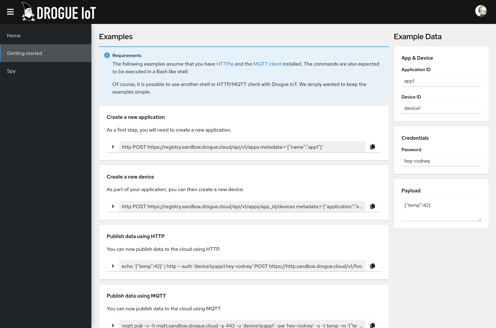
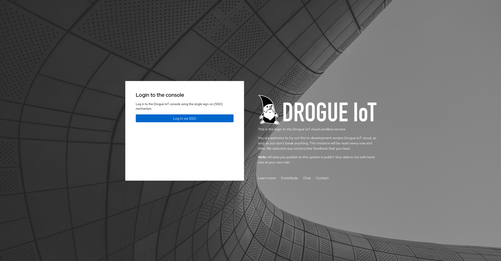

+++
title = "Drogue Cloud: Release 0.3.0"
description = "The new release 0.3.0 of Drogue Cloud features command and control, an improved device registry, X.509 device certificates, and more …"
extra.author = "ctron"
+++

So far, we didn't really *release* anything. We created tagged versions, so that you don't need to rely on `latest`,
which might change any second. We had a *release* pipeline in the CI. Still, it just didn't feel *ready* enough.
This time it is different.

<!-- more -->

## New and noteworthy

The new release mostly added some missing features and improved on the existing ones. It still isn't complete, but
a big step forward.

### Command and control

This release introduced the concept of *command & control* (aka cloud-to-device messaging). There is a dedicated
*drop-off endpoint* for commands, and both the HTTP and MQTT endpoint have been enhanced to take care of this
functionality. Using HTTP you can wait for a short time to receive a command when you deliver some payload to the cloud.
For MQTT, you can subscribe and wait for commands to come along.

This is just the first iteration on this. There are a bunch of things left to solve. However, currently there is
[RFC 2](https://github.com/drogue-iot/rfcs/pull/2) open, working on refining the APIs and the behavior of this
functionality. You are welcome to join.

### Better getting started experience

When you installed Drogue cloud, you already got some information and example commands in the end to try it out.

However, when you didn't install it yourself, then you didn't get this information. So we added the same information
on the web console:

You put in the information on the right side, and the out the commands for executing on the command line. Even if you
never installed Drogue cloud yourself.

Also did we integrate all services with the installed Keycloak instance. Read on, if you want to know why this is so important.

### Device registry improvements

A lot of work went into a refined device registry. The highlights are:

  * Scoping of devices by *application* (aka tenants, aka namespaces, aka …)
  * Password and Username/password authentication
  * X.509 client certificates authentication for devices
  * Added the concept of *gateway devices*

Technically we switched from a [Diesel](https://diesel.rs/) based backend to
[tokio-postgres](https://github.com/sfackler/rust-postgres), which allows us to use `async` all the way. However, this
is something that you shouldn't even notice.

The much improved API however is something that should notice. Creating applications and devices is now possible, as is
updating and deleting them: CRUD! There is a lot of work planned in this area, so the APIs will definitely be changed
again.

Yes, *applications* is a concept we introduced in this release as well. Some other systems may call this "project",
"namespace", "tenant", or "scope". It is a container, which owns devices. You can create a new "application", and then
add "devices" to it. Deleting an application will also delete all the devices.

Authenticating devices has also improved a lot. You can use a simple combination of "device" and "password", or use
an explicit username/password combination. Or you can go crazy and create your own trust anchor, issuing X.509
client certificates.

## The sandbox

Setting up Drogue Cloud can be done on your local machine, using Minikube, CRC, or Kind. Of course, you can also deploy
this on a real cluster. However, that may take much more effort.

On the other side, we need to have a publicly available instance for our development as well. Playing with services like
*The Thing Network* requires public access to our services. So, why not host our own instance.

As we already used [Keycloak](https://www.keycloak.org/) for single sign-on, it was pretty easy to integrate this
with GitHub, and let everyone create an account. In a nutshell, we have a publicly available sandbox, for everyone to
play with.

**Note**: Read the text on the login page carefully! This is an open sandbox, none of the data you send to this instance
is safe! It may also go down any second!

As you can see, the warning message is bigger than the login dialog. Getting started is easy, as you only need to log in
with your GitHub account.

We are aware of the fact that some functionalities, also security related, are still missing. That is why we plan to
upgrade the instance with every release of Drogue Cloud from now on. However, if you just want to play with the
embedded Rust stuff, you may now have something to send your data towards, without the need to deploy something yourself.

## Next steps

There is already lot of stuff going on:

  * **Defining CloudEvents mappings** – [RFC 3](https://github.com/drogue-iot/rfcs/pull/3)

    Currently, the way we fill the CloudEvents attributes is a bit inconsistent. We plan to improve on this, and you are
    welcome to join the effort.

  * **Service authentication/authorization**

    Yes, this is missing, we need it. Embarrassing, but it will come. 

  * **Integration device registry**

    This is a major topic, and will cause some changes in the device management APIs. In addition to configuring our own
    system, we also want to use our device registry to configure other services, so that we can easily integrate with
    them. For that we need events when applications and devices change, and a reasonable way to reconcile.

  * **A CoAP endpoint**

    CoAP is definitely something that we want. And maybe, we can have it sooner rather than later. Adding CoAP on the
    cloud side is a proposed project for Google Summer of Code, and there seems to be already interest in that project.
