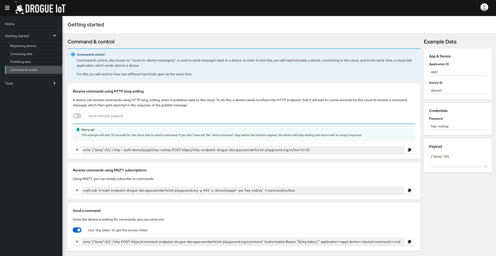

+++
title = "Drogue Cloud: Release 0.4.0"
extra.author = "ctron"
description = "Welcome to Drogue Cloud 0.4.0: Here is what is new and noteworthy."
+++

Today we released Drogue Cloud 0.4.0. This is a huge step forward in so many areas, let's take a look.

<!-- more -->

## Ownership of resources

The previous release did not have any ownership of resources. It was a conscious decision we made, as we wanted to
release early, and also make the sandbox instance available for people to try out.

This release picked up that remaining task, and introduces the ownership of resources. Leveraging the existing OAuth2
integration to not only authenticate users, but also to authorize their requests.

With that, it is no longer possible to read any application or device, or consume any message stream. You may only
access the resources you own. For now, that is a very basic access model, but we will improve that over time.

Along with that, we also improved the validation of devices and their gateways. When a gateway acts on behalf of a
device, we now verify that the gateway is authorized to do so. Currently, this is possible by assigning one or
more gateways explicitly to a device, but we already have plans to do this for a group (or label) based mapping.

## Tokens all the way

In the previous release we already had OAuth2 and Open ID connect, but we mostly used it for the web console.

In 0.4, all the services, even internal ones, use OAuth2 tokens for performing authentication.

We also integrated the Eclipse Ditto, digital twin, instance with the single sign-on instance of Drogue Cloud.

## Command line interface

A downside of using tokens is that you always need a fresh one. Acquiring tokens is an extra step and tokens
are a bit complicated when using a simple `http` client on the command line. 

So, it was time to start working on a command line client, which takes away all the "glue operations" required to
exchange tokens in order to interact with Drogue Cloud. Of course, that client now handles all the tokens, refreshes
them when necessary, and helps you acquire an initial token using the browser flow. Just run:

~~~
drg login http://sandbox.drogue.cloud
~~~

And, you will be guided through the login process. Once you have a valid token, you can create applications and
devices just like:

~~~
drg create app my-app
drg create device --app my-app my-device
~~~

As always, this is just the beginning. We now have a solid foundation, which allows us to build on top of this. You may
find our backlog of ideas right here: https://github.com/drogue-iot/drg/issues

## The integration device registry

The device registry also received a lot of attention during the 0.4 release cycle. One part was definitely the
introduction of access control, which impacted the device registry most. But we also beefed up the APIs a lot.
Borrowing ideas from Kubernetes, e.g. annotations, labels, finalizers, soft-delete, generation and resource version, …

Finalizers, for devices? Well, a major new feature of the device registry also is the ability to send out change events.

Change events, finalizers, and the ability to use optimistic locking allow us to create controllers (or operators) for
the device registry.

The idea is pretty simple: No IoT solution can stay on its own, it is the "Internet of Things", not the
"Silo of Things". For that we need to integrate with other systems. And, most systems already come with the concept of
a device registry. So most systems expect you to create resources, like a device, in their system as well.

Let's take the "The Things Network" (TTN) system for a second. You might have read our blog posts about setting that
up with Drogue Cloud. That requires you to create an application and device in our system, and an application and device
in their system. Why not simply create an application in our system, add some "TTN API token" and let it reconcile
the devices from Drogue Cloud to TTN?

You see, that opens up a lot of possibilities, and makes things a lot easier.

## Command & Control

Command and control learned a few new tricks as well. The most noteworthy one might be the fact that it can deal with
external command endpoints now.

So far we had been able to send command to devices when that where connected. Like an MQTT subscription, or an HTTP long
polling operation.

Now, we can also send commands to gateways, or services, when a device is not directly connected. Let's come back to
the TTN example: The TTN API allows you to send a command for a device at any time. It will take care of the delivery
to the device.

You can now configure a device in Drogue Cloud to leverage this functionality. The same command API on the Drogue Cloud
side, that normally sends to connected devices, can now also use a pre-configured external command endpoint.

## Integrations

Naming things is hard. So far, Drogue Cloud had the ability to let users consume messages from the internal Kafka topic.

And, while consuming directly from Kafka is a nice idea, or letting Knative eventing push you some HTTP events, a lot
of people currently use e.g. MQTT to consume IoT related messages.

That is why we created an MQTT service, which allows you to consume messages coming from devices, using MQTT. Both MQTT v3.1.1 and v5 are supported. You can receive messages using Cloud Events structured or binary format, and also have
the ability to use "shared consumers", to split the load between different MQTT consumers.

We definitely want to expand this concept in future releases. AMQP 1.0 and simple websockets might be good additional
protocols to implement.

The hardest parts was: what do you call those services? We ended up with "Integrations", because it allows you to
integrate your application, that wants to interface with your devices, with Drogue Cloud. Using a technology that you
prefer.

## Bug fixes and performance improvements

Of course there is a huge list of minor things that we did as well, like improving the web console, simplifying the
endpoint configuration, improved health endpoints, … you know: bug fixes and performance improvements!

## What's next

For you? Try it out! Definitely! The simplest way to do this is to head over to the sandbox and give it a try:
https://sandbox.drogue.cloud

For us? There is a long list of things that we would like to improve in the current system, like proper QoS 1 handling
with the MQTT integration. Or the long list of improvements we put down for `drg`. Definitely we want to showcase the device registry integration capabilities by implementing the "The Things Network"
operator. Letting Drogue Cloud manage devices on the TTN side.

Then again, it is an open source project. You are welcome to join the project, and let us know what you would like to
see next. Have a chat with us, and maybe even start working on topics that would make your life easier.

