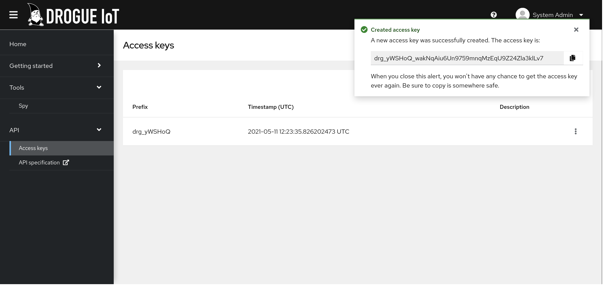
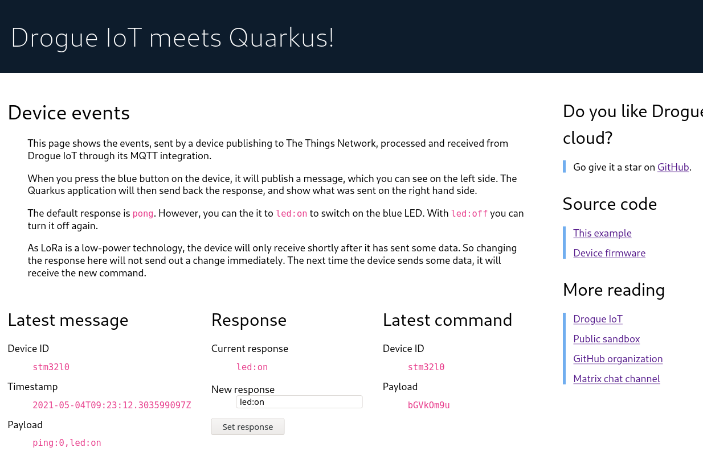
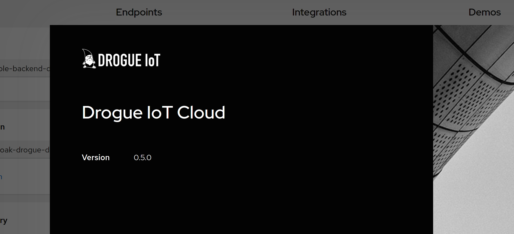

+++
title = "Drogue Cloud: Release 0.5.0"
extra.author = "ctron"
description = "Welcome to Drogue Cloud 0.5.0: API revamp, The Things Network operator, access tokens, and an end-to-end workshop."
+++

Today we released Drogue Cloud 0.5.0. It brings together a lot of things that have been cooking for a while. 

<!-- more -->

## API revamp

In the past we have been adding API endpoints and structures as we needed them. We knew that at some point, we needed
to revisit this and iron it out a bit. This release, it was time to focus on this.

Not only did we create an OpenAPI 3 specification, which gets deployed using SwaggerUI alongside the console,
we also have a [Rust client](https://github.com/drogue-iot/drogue-client) ready to use. Indeed, we are using that
ourselves ;-)

Turns out, we didn't need to change much. It mostly was cleaning it up a bit. But it also turns out, we will need to
revisit this again in the future. There are a few items that are missing (like bulk operations, JSON patch support, or
an aggregated API endpoint). Still, it is a big step forward, and future changes should be more additions, rather than
refactorings.

## The Things Network operator

In 0.4.0 we added [registry change events](@/2021-03-30-drogue-cloud-zero-four/index.md#the-integration-device-registry),
and we mentioned "The Things Network" (TTN), as an example to reconcile devices with. Well, we just implemented that.

You can now create a new application and Drogue Cloud, add some devices, and have that sync with The Things Network once
you provided a TTN API key. As yes, we are using the v3 API!

Of course this is only the first example what you can do with this. In the future, we plan to add some more "operators",
to reconcile with additional systems: Apache Kafka, Knative, Eclipse Ditto, and whatever comes up. Of course, if
you have some ideas yourself, we are welcome to share your thoughts.

## API access tokens

For [the newly introduced MQTT integration](@/2021-03-30-drogue-cloud-zero-four/index.md#integrations),
applications consuming data from the system using MQTT, we had implemented OAuth2 tokens for authenticating MQTT clients.

Turns out, yes this works, but not very well with most MQTT clients. A typical alternative to OAuth tokens for
service-to-service authentication are access tokens (aka API keys, API tokens, …). So we added support for those as well.

With Drogue Cloud 0.5.0, you can create (list and revoke) access tokens, which you can use as an alternative mechanism
for authenticating towards the MQTT integration. Other services will most likely follow in a future release. They
even have an initial page in the web console:

## An end-to-end workshop with Drogue Device

The main focus of the release though, was to show a proper end-to-end example. As mentioned earlier, this release
finally brought together all the required components and features to create a proper end-to-end example. We chose
a use-case of a LoRaWAN device, reporting its current state to the cloud, receiving back commands.

In order to make this lightweight, as-a-service, and easy to develop, we chose to run Drogue IoT as a service
(which you can do yourself), and deploy a small Quarkus application, connecting via our MQTT integration for telemetry
data and sending commands.

This allows you to run the Quarkus application on your local machine, reaching out to a public Drogue IoT instance,
which is interconnected with The Things Network, acting as a LoRaWAN provider.

True, there are other ways to deal with connectivity. Both on the device side, as well as on the cloud side. However,
using this example, you can easily run this on your local machine. And, you can use any MQTT tool you already have, for
debugging.

In order to replicate this yourself, we compiled a [complete end-to-end workshop](https://book.drogue.io/drogue-workshops/ttn-lorawan-quarkus/index.html) in our [book](https://book.drogue.io). Having the right hardware,
that should allow you to re-create this yourself: Drogue Device, TTN, Drogue Cloud, Quarkus!

## Harder, Better, Faster, Stronger

A lot of minor things have been improved and fixed. Support for deployments on GKE, an about dialog in the web console,

`drg` has been improved as well: Search, improved login, support for Brew, a Windows binary, and
more. 

## What's next

Unfortunately we didn't get the resource sharing done in time. So inviting members to your application needs to wait
for 0.6. We also found a few areas where we need to improve the experience in writing operators for the device registry.

Definitely, we also want to create more workshops. There are already so many variants you could use Drogue IoT with.
We just need to document them, in an easy to consume way.

When it comes to Kafka, we also want to improve the way a user, or application, can configure its topics. A single
topic down to a dedicated topic per channel.

As always, you are welcome to join and give it a try on [our sandbox](https://sandbox.drogue.cloud).
