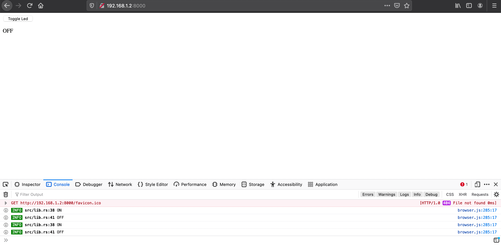

+++
title = "Drogue Device conquers the browser"
extra.author = "lulf"
+++

What does embedded and web frontend apps have in common? Turns out it's quite a lot! Read on to see how Drogue Device have conquered the browser.

<!-- more -->

# Whats new?

As discussed earlier, [Drogue Device](https://blog.drogue.io/drogue-device-rebase/) was refactored to integrate with [Embassy](https://github.com/embassy-rs/embassy) as its runtime. Since then, we've worked with the Embassy project to improve support for STM32 microcontrollers and as well as other minor improvements and fixes. Drogue Device is more concerned with being an Actor framework, a collection of drivers for IoT use cases (With connectivity such as LoRa, WiFi, and more to come!), integration with [Drogue Cloud](https://github.com/drogue-iot/drogue-cloud/) and having examples for different boards geared towards IoT connectivity.

One day, an idea came up to run Drogue Device in the browser. Why would you do that? Well, it's not a primary use case for Drogue Device, but the similarity between Rust in the browser and on embedded is that they both require code to work without the standard library (`no_std`). Clearly, we could not pass on this opportunity!

In this post, we'll give you some references on how to run Rust applications in your browser, and more specifically: you how you can run Drogue Device in a browser, using a button HTML element as input (simulating a ... button!), and a standard text element as output (simulating a LED). For the impatient, the full example can be found [here](https://github.com/drogue-iot/drogue-device/tree/main/examples/wasm/browser).

# Sounds good, how do we do that?

First, to use Rust in the browser, you can use [wasm-bindgen](https://github.com/rustwasm/wasm-bindgen). It provides a way to build Rust WebAssembly(WASM) modules, and to a bidirectional mapping with JavaScript code if you wish. Building a WASM module can be done using the `wasm-pack` tool. There are plenty of examples [here](https://rustwasm.github.io/docs/book/), and [here](https://rustwasm.github.io/wasm-bindgen/), with varying degrees of complexity and integration with JavaScript.

# Can browsers do async though?

Yeah, they can! With the [`wasm-bindgen-futures`](https://crates.io/crates/wasm-bindgen-futures), one can spawn async tasks in the same way that the Embassy executor can. And in our case, we can invoke the Rust main function as an async function as well!

To invoke our Rust main, the following snippet goes in the HTML:

```
<script type="module">
    import init from './pkg/browser.js';

    async function run() {
    await init();
    }

    // This calls the module init which spawns the drogue device
    run();
</script>
```

And the corresponding Rust function main function that is invoked on script start is located here

```
#[wasm_bindgen(start)]
pub fn main() -> Result<(), JsValue> {
    spawn_local(async move {
        // Code goes here
    });
    Ok(())
}
```

The `spawn_local` is the entry point for spawning async tasks in `wasm-bindgen-futures`. In our example though, the task spawning will happen within Drogue Device itself, as we will see in a moment.


# What about peripherals?

There are no physical peripherals in a browser. However, you can think of HTML buttons in the same way as a button in the physical world. You can also modify the state of the world in the browser (the DOM).

Lets use the following HTML elements to represent a button and a LED:

```
<button id="button">Toggle</button>
<div id="led">OFF</div>
```

In Rust, we need to simulate the peripherals that interacts with these elements:

```
pub static mut INPUT1: InputPin = InputPin::new();
pub static mut OUTPUT1: OutputPin = OutputPin::new();
```

At initialization, the an `InputPin` and `OutputPin` can be configured to map to an HTML element. We can do so in our main function:

```rust
unsafe {
    INPUT1.configure("button");
    OUTPUT1.configure("led", |value| if value {"ON" } else { "OFF" });
}
```

These are global mutable variables, so an unsafe block is needed. Since the module load is only called once, it is safe to call configure from here.


I will not go through the implementation of `InputPin` and `OutputPin`, but what you need to know is that the `InputPin` will bind to the `click` JavaScript event for a given HTML element (provided by its `id` attribute). For the `OutputPin`, it will set a text value for a HTML element based on the output of the provided closure. The implementation of these types can be found in the [git repository](https://github.com/drogue-iot/drogue-device/tree/main/examples/wasm/browser).

Now we need some rust types that we can hand to the `Button` and `Led` actor types that are provided by Drogue Device. For that, we have created the `WebButton` and `WebLed` types, which implements traits from the `embedded-hal` and `embassy` crates, which mimic the behavior of their embedded counter-parts.

```rust
let button = WebButton::new(unsafe { &INPUT1 });
let led = WebLed::new(unsafe { &OUTPUT1 });
```

# Wiring up Drogue Device

Now that we have the peripherals implementing the required traits, we can configure drogue device like we would in any embedded application. First, lets define our device type and create the static instance:

```rust
struct MyDevice {
    led: ActorContext<'static, Led<WebLed>>,
    button: ActorContext<'static, Button<'static, WebButton, Led<WebLed>>>,
}

static DEVICE: DeviceContext<MyDevice> = DeviceContext::new();
```

In our main function, we'll initialize the actor for our device with the peripherals:

```rust
DEVICE.configure(MyDevice {
    led: ActorContext::new(Led::new(led)),
    button: ActorContext::new(Button::new(button)),
});
```

Finally, we need to mount the device. Mounting a device means spawning the per-actor tasks that wait for incoming messages for an actor and runs the processing loop. Since we're running in a browser, we cannot use the Embassy executor, because it will loop forever awaiting actor tasks. Instead, we'll re-use the async spawn capability of `wasm-bindgen` and implement the `ActorSpawner` trait, which will enable it to be used when mounting a device:

```rust
let spawner = WasmSpawner::new();
DEVICE.mount(|device| {
    let led = device.led.mount((), spawner);
    device.button.mount(led, spawner);
});
```

And thats it! The same actors and framework used in the `nRF52`, `STM32` or `rPi Pico` examples can be used in WebAssembly! Once example is built and running, the end result looks like this after clicking the button a few times:



# Whats next?

So, does this mean drogue device has changed focus and will be Web 4.0? Probably not! Instead, consider this an example how drogue-device can be used with any async executor in `no_std` land, with some minimal glue code attached.

An application of running drogue-device in the browser could be to replicate state of an embedded device, like a digital twin in real time. It would require some sort of component library built to mimic the embedded variants, but it would be interesting to see how far that could go.

If you have an interesting use case, please reach out to us on [github](https://github.com/drogue-iot/drogue-device) or in our [matrix chat](https://matrix.to/#/#drogue-iot:matrix.org).

# Summary

In this post we've first presented some new advancements in drogue-device. We then went to show how Rust WebAssembly applications can simulate peripherals from an embedded environment using HTML elements. We then showed how to wire the peripherals into drogue device actors, and launching the drogue device using the browser runtime.
