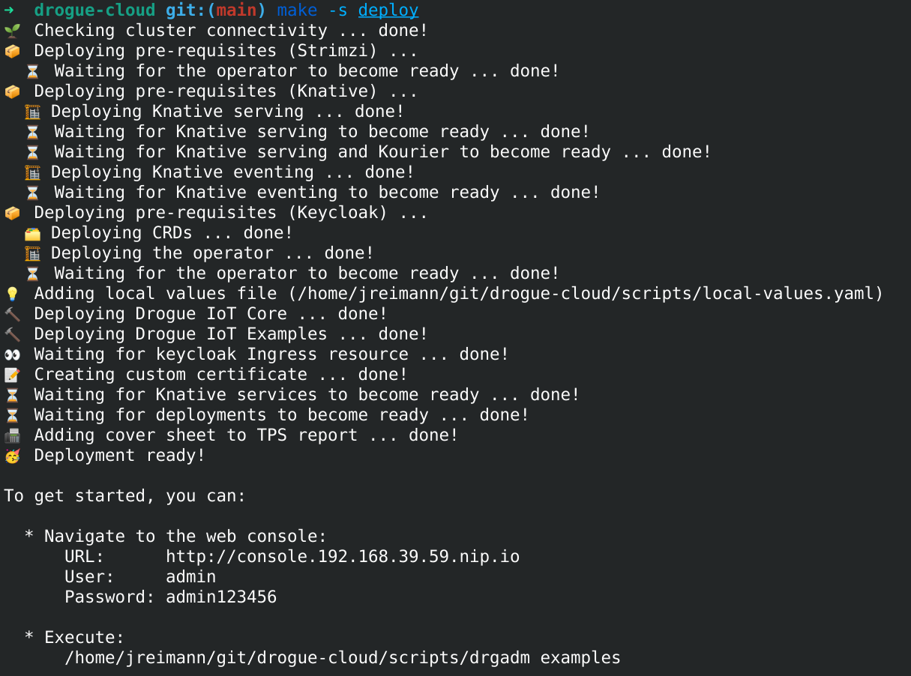
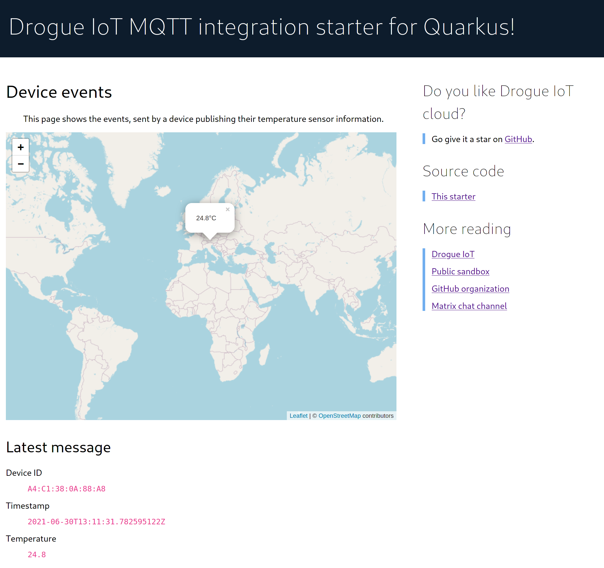
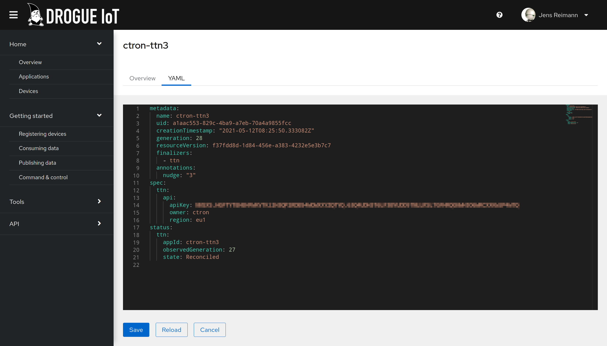

+++
title = "Drogue Cloud: Release 0.6.0"
extra.author = "ctron"
description = "Drogue Cloud 0.6.0 is finally out: Finer grained access control, improved Web UI, Helm Charts, direct Kafka integration, and more!"
+++

Drogue Cloud 0.6.0 ran a bit late. But, it is ready when it is ready! This time, the focus was more on improving on what we already have. And taking a look back, we improved a lot.

<!-- more -->

## For the impatient

In this release we focused on improving existing functionality:

* Added automated, end-to-end testing
* Switched from Kustomize to Helm, dropping many of the shell based pre-/post-processing
* Directly connect to Kafka
* Finer grained access control, a public data stream, and a new workshop based on Quarkus and MQTT
* Successfully tested running on GKE
* Support for viewing and editing of applications and devices in the web console
* Aggregated API endpoint, switch to Kubernetes Ingress for services
* Bug fixes and performance improvements

## Improved Testing

Testing isn't an easy topic if you want to do it right. And while other programming languages have a head start on this,
Rust, being a fairly new language, has a bit of catching up to do.

In Drogue Cloud we already have some unit tests and a few more tests, testing complete services. But so far, we did not
have any complete, end-to-end system tests. That has now changed.

The goal was that we have some testing pipeline, which performs a complete test run, with a released or pre-released
version of Drogue Cloud. Spin up a Kubernetes cluster, deploy Drogue Cloud, install `drg` and run some tests against
that installation. Including testing the web UI. And of course, we wanted to stick to the programming language we
love: Rust.

In the [drogue-iot/drogue-cloud-testing](https://github.com/drogue-iot/drogue-cloud-testing) repository, you will now
find a test suite, which takes care of that. This is an on-demand process where we can request a test run and validate
a packaged installer. And while we are using GitHub actions to orchestrate that, we use external compute resources to
have the resources we need.

As you can imagine, it is worth the effort, but it also took a bit more time than expected.

## Helm charts and GitOps

We started out using YAML files to get Drogue Cloud deployed. When we needed a bit more flexibility, we switched to
Kustomize. Still, we found out that we need even more flexibility. We wanted to have the ability to turn certain
features on or off. Swap out the container registry with a single setting, replace the provided Postgres or Kafka
instance with an existing, external one. All of this is pretty simple when using Helm.

Why didn't we pick Helm in the beginning? Well, creating Helm charts comes with a bit of complexity. Plain YAML files
are much simpler. In Drogue Cloud we try to start simple and adopt more complex technologies when we see a benefit.
Like in this case, we figured out that we grew out of the plain YAML files and Kustomize, and so we moved on.

And with the migration to Helm Charts, we could also drop a good portion of our accompanying shell scripts, tweaking
things after applying the deployment. This finally allows us to perform a more GitOps style approach when deploying
Drogue Cloud. The sandbox we are operating is now being deployed using ArgoCD. With that, we can always check the state
of the deployment. See if it is out of sync and what will change when we reconcile.

For the shell script installer, that still exists. It is a bit fancier than before and uses Helm in the background. But
you can still deploy Drogue Cloud with a single command to your cluster:

## Direct Kafka interface

We still think that Knative eventing is a great tool to easily wire up event streams and services. And still, in the
Drogue Cloud infrastructure, we have a few use cases, which are not covered by Knative eventing. And which seems to be
out of scope too.

One example is our MQTT integration service. When a user connects to that service and starts a new subscription, events
will flow to that connection. This type of setup is a more "on-demand" or "pull model" style of receiving events. The
decision that events should flow to that consumer is not made by Drogue Cloud, but by the user connecting to that
service. This is a model which Knative eventing doesn't support, but we think it is crucial for an IoT-as-a-service
solution.

Does that mean we gave up on Knative eventing? Absolutely not! Cloud Events, which is the event specification used by
Knative Eventing, is still at the core of Drogue Cloud. We also use Knative Eventing on the [application-side](https://book.drogue.io/drogue-cloud/dev/concepts.html#_applications), to
process, transform, and consume events. So with that, you can still use for example a
[`KafkaSource`](https://knative.dev/docs/eventing/samples/kafka/source/) to have messages flow towards your Knative
service.

With the combination of the more flexible Helm charts, this now also allows one to use an externally managed Kafka
instance, like [Red Hat OpenShift Streams for Apache Kafka](https://developers.redhat.com/products/red-hat-openshift-streams-for-apache-kafka/getting-started).

## Finer grained access control, public data stream, Quarkus MQTT workshop

We already added API tokens in 0.5.0, so that you can easily give applications access to Drogue Cloud. In 0.6.0 we
expanded access control in a different direction. Beside having the ability to transfer ownership of an application,
you can now assign a list of members and assign a role for each member. Roles include reading, modifying, or
administrating an application and its resources. Basically, you can grant access to an application to others,
including the "anonymous user".

And with that, we can realize a public stream of data. If you have used Drogue Cloud before, you might recall the
temperature example that we use as an example. We spiced this up a little bit, deployed this on the sandbox, and made
the application readable to anonymous users.

For one, you can simply get the stream using the following command:

~~~
mqtt sub --topic app/drogue-public-temperature --host mqtt-integration.sandbox.drogue.cloud --port 443 -s
~~~

This also allowed us to create a second workshop in our "book". The workshop uses Quarkus and
MicroProfile to consume data from the MQTT integration and to implement a web dashboard, showing the temperature and its
geo-location on a map.

Using the sandbox and the public data stream, you don't need to deploy Drogue Cloud yourself. You can start right
away, focussing on the cloud side of things. Either using our [quarkus-mqtt-integration-starter](https://github.com/drogue-iot/quarkus-mqtt-integration-starter), or with a more guided approach through our workshop.

Curious what this looks like? Take a peek:

Or take a look at the running version of this application: [https://quarkus-mqtt-integration-starter-drogue-quarkus-demos.apps.wonderful.iot-playground.org/](https://quarkus-mqtt-integration-starter-drogue-quarkus-demos.apps.wonderful.iot-playground.org/)

## But wait, there is more …

We provide out of the box support for Minikube, Kind, and OpenShift. However, we want to ensure that Drogue Cloud runs
on all Kubernetes distributions. So a long-standing goal was to actually test this, and fix issues that would
prevent us from doing so. For 0.6.0 we have successfully tested running on top of Google Kubernetes Engine (GKE).

All services are now exported through an aggregated API endpoint. The device registry can now handle hashed passwords.
Switch to Kubernetes Ingress for console and API endpoints. Fix up a lot of labels for different Kubernetes resources.

The web console has a bunch of new pages, mainly around applications and devices. It is now possible to view some
information in a structured form. And additionally, you can also edit the YAML directly from the web console.

## What's next

The Kafka interface layer still needs to handle the one-topic-per-application model. However, cleaning up the Kafka
interface felt more important, and so we postponed this task for the 0.7.0 release.

We want to add some additional IoT specific endpoints. Making Drogue Cloud more compatible with other systems, and
allowing to leverage existing APIs sounds like the good idea. Our plan is to take a look at some existing open source
APIs, and try to add them. Eclipse Hono and FIWARE come to our mind.

Improving the developer experience even more is also on our list. For example, providing edge-side SDKs in languages
like Python. Creating some more examples and workshops using Kafka and Knative. Maybe in combination with
Quarkus and Funqy.

Running on GKE is fine, but we also want to test Drogue Cloud on Azure, AWS, and others. If you have an interest in
this too, feel free to join this effort.

We also labeled some issues now with [help wanted](https://github.com/drogue-iot/drogue-cloud/issues?q=is%3Aissue+is%3Aopen+label%3A%22help+wanted%22). Just in case you are looking for a way to contribute. 

As always, you are welcome to join and give the new version a try on [our sandbox](https://sandbox.drogue.cloud).

## Also see

* [Releases](https://github.com/drogue-iot/drogue-cloud/releases)
* [Drogue Cloud Testing](https://github.com/drogue-iot/drogue-cloud-testing)
* [Public sandbox](https://sandbox.drogue.cloud)
* [Quarkus MQTT integration starter](https://github.com/drogue-iot/quarkus-mqtt-integration-starter)
* [Quarkus MQTT integration workshop](https://book.drogue.io/drogue-workshops/quarkus-mqtt-starter/index.html)
