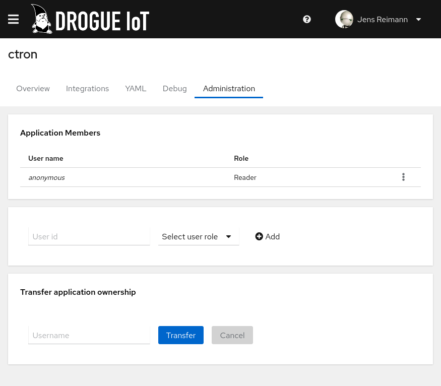

+++
title = "Drogue Cloud: Release 0.8.0"
extra.author = "ctron"
description = "Drogue Cloud 0.8.0 make a lot of things easier: Improved web console, topic provisioning using the Kafka Admin Client, improved gateway device support, static server binary, and more."
+++

This is our "end of the year" release, and we did want to focus on improving what we already have, rather than
introducing a bunch of new functionality, before leaving for the holiday season/Christmas. So we put a lot of
effort into cleaning up, filling some gaps that we identified, and polish the current functionality.

<!-- more -->

## Improved web console

We believe that the web console plays an important role into getting started with Drogue Cloud. Sure, once your know
your way around, a CLI like `drg` or directly using our REST API might better for you. But until that point, the
web console should allow you the get the basics done in a manual way.

That is why we expanded the current functionality of the web console with features that already had been available
under the hood. Adding users to an application, transferring ownership, or directly monitoring traffic from the
application view for example.

As always, we will also update our public sandbox with the most recent, released version. So you can directly try out
the new features.

## Kafka topic provisioning, reloaded!

In 0.7 we introduced Kafka topic provisioning, using Strimzi. Creating a new application will automatically spin up
a new Kafka topic for it, and setup access. We already designed this as an extension point, so that one could drop
in an alternative implementation of that.

Well, in 0.8 we did that. In addition to the Strimzi based topic provisioner, we added a plain Kafka Admin client
based one. And while the downside is, that this cannot create a new user for the consuming side for you, it has the
benefit that it works with any Kafka service that provides the Kafka Admin API.

We will follow up with an additional blog post on this the near future. So, stay tuned if you are interested!

## Improved gateway device support

During the authentication and authorization process of devices, we already supported the idea of a gateway. However,
once the device was connected, we didn't. For session-less protocols (like HTTP or CoAP) this didn't really matter.
For MQTT however, it does. MQTT allows a device to connect (and authenticate). If however that device is a
gateway, it should be able to publish on behalf of other devices, without the need to reconnect.

So for Drogue Cloud 0.8, we added the ability for MQTT to authorize publish (events) and subscribe (commands) operations
independently of the MQTT connection phase. Meaning: MQTT gateways can now act on behalf of other devices, if they are
configured to allow this. As the concept existed before 0.8, no new configuration had to be added, just the APIs for the
MQTT endpoint got extended to support this.

## Static server binary

Deploying a complex, cloud native stack like Drogue Cloud can be tricky. We put a lot of effort in our installer scripts
and Helm charts to make it both easy and customizable. However, every now and then, it would be nice to "just run"
Drogue Cloud. With 0.8, you can!

Assuming you have an existing Kafka, Keycloak, and PostgreSQL instance, it is as easy as:

~~~shell
drogue-cloud-server --enable-all
~~~

And, it also works on Apple M1 machines. Does it bring all the features? No, it can't. There are a few that we will
add in future releases, but we are not planning to re-invent Kubernetes. Does it run on a Raspberry Pi too?
Probably, we didn't have the time yet to try out. But we definitely want to get there.

If you are curious, you can read more about it in a [previous blog post](@/2021-11-08-introducing-drogue-server/index.md) or
[in our documentation](https://book.drogue.io/drogue-cloud/dev/deployment/bare-metal.html).

## More workshops

The idea behind our workshops is to give you concrete examples on how to use Drogue Device and Drogue Cloud. And to
enable you, to replicate this on your own. And since the last release, we added two more workshops to our list.

### Eclipse IoT package – Telemetry end-to-end

The first one was in the making for quite some time. It shows the integration of a handful of IoT related open source
projects from Eclipse IoT. And so this is in fact not a Drogue IoT workshop, but an Eclipse IoT package
named [Telemetry end-to-end](https://www.eclipse.org/packages/packages/telemetry-e2e/).

It showcases the use case of telemetry data acquisition, from a Drogue Device based microcontroller,
through an Eclipse Kura IoT gateway, into Drogue Cloud. On the cloud side we have Eclipse Ditto as digital twin platform
and Eclipse Streamsheets to visualize the data. All you need is a micro:bit v2, a Raspberry Pi, and your local machine.

It also showcases how important the ability to integrate is. All these different projects, developed by different
communities, can still work together to solve problems on the different layers of an IoT stack. Try it out, and maybe
replace a component yourself.

Of course, you can also cheat and just focus on the cloud side running on your laptop. Should you want to skip on buying
a few new toys to play with.

### From WiFi to Websocket

This example walks you through a set of steps, creating your own microcontroller firmware, measuring a temperature,
and sending that to the cloud. Heard that before? Well sure, not only is this our prime example for the use
case of sending telemetry data to the cloud, we also have a few other examples doing the same. Just not one that is a
complete workshop, including a WiFi based firmware.

On the cloud side, the workshop focuses on re-using an existing Drogue cloud instance. You still host the cloud
application, the part which consumes the device data, yourself. And as always, you are also able to run Drogue Cloud
yourself.

But the focus of this tutorial is to re-use existing cloud services, to host all functionality on infrastructure managed
by someone else.

There are two examples of how to consume data using WebSockets. A custom WebAssembly application and a ready-to-use
TimescaleDB/Grafana dashboard. They represent a good starting point for developing IoT applications based on
Drogue Cloud.

## Follow-ups

API keys, which we renamed to "access tokens" in 0.8, can now be used in more situations, like accessing the device
management API. This allows you to more easily create applications, which struggle with the OAuth2 way of doing things.

In 0.7 we also switched the time-series database of our example to TimescaleDB. Thanks for some help from Timescale,
we have been able to really improve this part of the example. Many thanks for that. If you are interested, take a look.

Our CLI companion tool `drg` has also been released as `0.8.0`, to catch up with API changes. We also added a new
subcommand: `admin` which helps you to manage applications, users, and transfer ownership, as well as manage access
tokens for all your consuming apps.

## What's next

There are two major topics we want to tackle in 2022: digital twins and observability of the infrastructure. Both topics
are quite complex, so don't expect them to land right away in the next release.

Digital twins are important as a development model for IoT application. And while we already have a brief demo with
Eclipse Ditto, we want to expand this integration, and make it much more useful.

Having metrics and tracing in the different services is a pre-requisite for scale testing. We are building this for
scalability, so we need be able to gather some data around this. And again, this will be a bigger topic for 2022.

Of course, we also have some mid-term goals. More examples and workshops is definitely on our roadmap. If you have
interesting topics you would like us to cover, reach out! A Quarkus based self-service Web UI for our temperature demo,
beefing up the Bluetooth gateway application for edge devices, improving application integration for the cloud in different development environments, improving the off-the shelf Grafana dashboard experience, and an OPC UA example
are all things we would like to get ready in the next cycle too.

And the next release cycle will probably be a bit longer, thanks to a few days of cookies, gifts, and time to
recharge batteries. 😉

## Also see

* [Releases](https://github.com/drogue-iot/drogue-cloud/releases)
* [Public sandbox](https://sandbox.drogue.cloud)
* [Server binary](https://book.drogue.io/drogue-cloud/dev/deployment/bare-metal.html)
* [Workshops](https://book.drogue.io/drogue-workshops/index.html)
  * [Eclipse IoT Package - Telemetry end-to-end](https://www.eclipse.org/packages/packages/telemetry-e2e/)
  * [From WiFi to Websocket](https://book.drogue.io/drogue-workshops/wifi-websockets/index.html)
