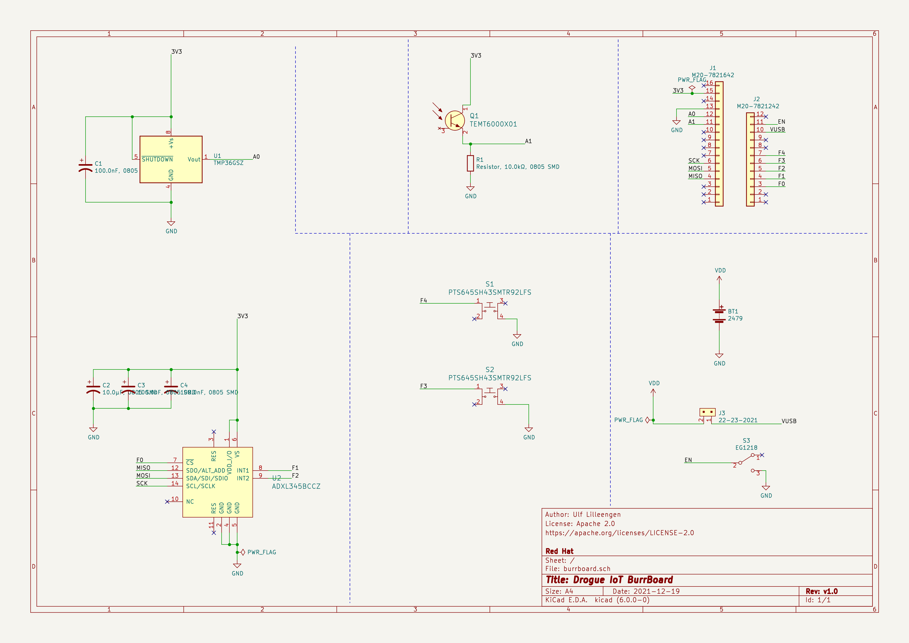
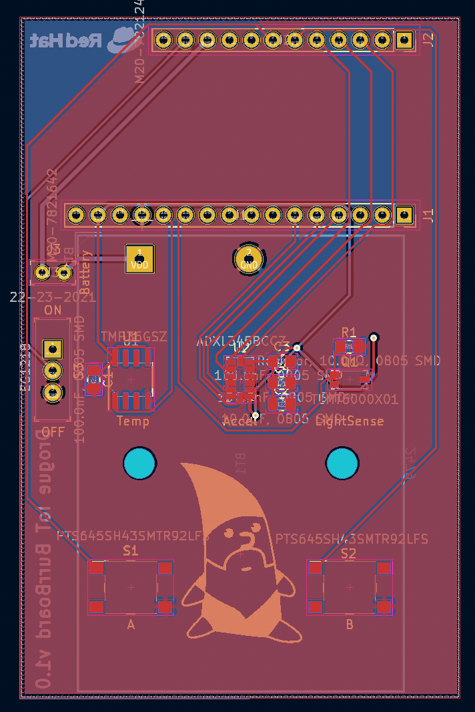

+++
title = "The making of a PCB: Part 1"
extra.author = "ulf"
+++

For some time now, we've wanted to have a Printed Circuit Board (PCB) that we could use to demonstrate Drogue Device and Drogue Cloud. This is the first post in a series of post telling the tale of this journey.

<!-- more -->

# Motivation

A few months back, an opportunity for designing our own PCB presented it self: there was a need to produce some custom devices for demos and workshops. Without going further into specifics, the devices will send and receive data to/from the cloud that runs Red Hat services on the Red Hat cloud. Since this is a good match for the Drogue IoT project, we started to gather some requirements. The initial list was:

* Must run on battery
* Report sensor data at regular intervals
* Receive commands over radio
* Sensors such as temperature and light sensors
* Buttons and some way to indicate status
* Wireless

The experience of designing PCBs in the group was almost non-existing, and even then there is the challenge of logistics: a potential large amount of devices when there is a global chip shortage going on needs some careful planning.

# Communication

For communicating with the outside world, we needed to look into RF protocols.

We started exploring the possibility of using plain Bluetooth Low Energy (BLE) for the device communication since we've already used that a few times. However, with a large number of devices, spread over big area, broadcasting to all devices using plain peer-to-peer BLE connections might not work well with gateways. In addition, this would require all devices to be within the range of a gateway. Luckily, the BLE Mesh standard solves a lot of these problems, and should work with up to 32768 devices, so it should be good enough for our use case.

An alternative to using BLE Mesh would be to use ZigBee/Thread, but due to the great driver support for BLE, especially on the nRF52 which we've used before, it seemed like the safest choice. You can read more about our BLE Mesh stack in [this post](https://blog.drogue.io/bluetooth-mesh/).

Likewise, LoRaWAN is not that great for this use case due to the bandwidth limits, and the additional latency added by the larger RF time slots.

# Selecting the microcontroller

With a global chip shortage, selecting the microcontroller to use was a challenge. Since we decided to use BLE, using nRF52 was a natural choice given the great support in Embassy. However, finding nRF52 available in larger volumes was harder than we thought due to chip shortage.

With the risk of not having the hardware available to us in time, we need to look into other options. Unfortunately, most STM32 chips that would fit our use case are also out of stock, which meant that we would need to spend more time on supporting new hardware.

## Host + Expansion board

In addition, getting the microcontroller hardware and peripherals correct for our first PCB was also a risk that we needed to deal with. Anticipating a few round trips of PCB re-design, we could risk not having hardware for writing our firmware until the last minute.

To deal with this risk, and solving the chip shortage problem at the same time, we decided to write an expansion board for a in-stock "host" board with the chip we wanted to use. We could order samples of the target board and start writing the firmware, while designing the PCB with the peripherals that we wanted to use in parallel.

We considered using the BBC micro:bit as the host board, but it turned out this was also out of stock. Luckily, Adafruit Industries had a lot of Adafruit nRF52 Feather boards available.

This meant that we would be able to target the nRF52840 chip, which has 256kB of RAM and 1024kB of flash, which should be sufficient for our use case.

The Feather boards with nRF52840 are available in two variants:

* Feather Express
* Feather Sense

The Feather Sense has a lot of sensors on board, which is great in that our PCB could be simpler. On the other hand, some sensors on board for temperature and light sensing are not easily identifiable, which we need for the types of applications that we will be running. Another disadvantage of the Feather Sense is the lack of a connector for debug probes.

The Feather Express has the SWD connector for debug probes, but does not have any additional sensors.

We decided to add the required sensors to our PCB and aim to use the Feather Express, but keep the Feather Sense as an option until we saw how well the PCB prototyping went. This way, we only needed to get the simpler circuit bits like LEDs and buttons correct.

# Initial design

With the host board somewhat decided, we could start on designing the PCB for the expansion board, with the code name `burrboard`.

The initial sketch looked something like this:

The light and temperature sensors would be clearly visible to allow manipulation by the user. The buttons are modelled after the micro:bit buttons to provide some way to interact.

For powering the device, we had several options:

* LiPo batteries
* Coin cell batteries
* AA/AAA batteries

The LiPoly batteries are natively supported by the feathers. However, they are a bit expensive and also we had some concern about the safety given that we were handing these out to a lot of people.

Using coin cell batteries was an attractive alternative that we initially wanted to use. However, these batteries do not handle current spikes well, and at the time we had no idea of how much power our application would use, given that we'd be transmitting and receiving data very frequently.

Therefore, going with 3xAAA batteries seemed like the safest and less risky route.

Only one question remained: how to power the feather using a custom battery? The LiPo connector is external to the feather, and it should not be used by any other battery type. After studying the pinout diagram and power documentation of the feather, one alternative stood out: powering the feather using the VUSB pin. Some testing on a breadboard hooked up to a Feather board confirmed that this approach would work. The only risk would be that
should the battery ciruitry be connected while USB is connected, we would risk to destroy a USB port that doesn't have reverse current protection. To protect against this, we added a power switch. To protect against the power switch layout being wrong, we added a jumper header for good measure.

# Learning KiCad

Which PCB design tool to use? Well, we like to do everything in the open and make it open source, so KiCad felt like the natural choice.

There are many guides and videos on using KiCad on YouTube, which was helpful in learning the basics of designing a PCB and what to look out for. I found the [videos from Digi Key](https://youtu.be/vaCVh2SAZY4) useful to learn KiCad.

The first step in creating the PCB was to draw the schematic. The initial revision looked like this:

It contains the following sensors with the required resistors and capacitors from their datasheet:

* [TMP36](https://www.analog.com/en/products/tmp36.html) from Analog Devices. This temperature sensor had plenty in stock, and seemed simple to wire, and can be read using the ADC on the nRF chip. It was available in both through-hole (THT) and surface mount (SMD) editions, which made it possible to prototype with it on a breadboard as well.

* [ADXL345](https://www.analog.com/media/en/technical-documentation/data-sheets/ADXL345.pdf) also from Analog Devices. This accelerometer was the only one that was in stock, had a breakout board available from SparkFun, and also had an existing [rust driver](https://crates.io/crates/adxl343) available.

* [TEMT6000X01](https://www.vishay.com/docs/81579/temt6000.pdf) from Vishay Semiconductors. This analog phototransistor was in stock, and also had breakout boards available for testing. As with the temperature sensor, we can read the data using the ADC.

While drawing the schematic, we ordered breakout boards or THT components of the sensors so that we could quickly test the firmware without waiting for the PCB to be finished.

The rest of the schematic contains

* Two [tactile push buttons](https://www.ckswitches.com/media/1471/pts645.pdf) for interacting with the device.
* A [battery holder](https://www.keyelco.com/product.cfm/product_id/1041) using 3xAAA batteries.
* A [power switch](https://www.digikey.no/no/products/detail/e-switch/EG1218/101726)
* A jumper header to ensure we don't accidentally connect battery in case of errors
* Headers matching the Adafruit Feather form factor

All the components are wired together in the schematic. You can find the KiCad project for Revision 1 [here](https://github.com/drogue-iot/burrboard/tree/1.0/feather). Note that the current revision as of this writing is 3.5, located in the main branch.

# Bill of Materials (BOM)

Perhaps the most challenging part of PCB design is locating the correct parts, primarily because there are so many variants of footprints to choose from. Some trial and error is expected when doing this for the first time, but most of the information needed is available in the datasheets.

For all the symbols in the schematic, we added manufcaturer part numbers as well as supplier-specific numbers where available. KiCad uses this information to generate a BOM with all the parts, and both suppliers and PCB assemblies can make use of this to quickly order parts or look if they have parts in stock.

# PCB layout

Once the PCB schematic and BOM is complete, its time to do some PCB layout. Once again, there are a lot of videos on how to do this in KiCad, so we won't cover that here. The initial version of the PCB looked like this:

As you can see, we managed to add a nice photo of Rodney on the board. Once the layout is complete, it's important to generate and check the gerber files. The gerber files are a set of files that each describe the layers of the PCB. In our case, we have a PCB with two physical layers, front and back. In addition, there are the solder mask layers, which describe the pads for SMD and THT components. The last part is the silk screen layer, where all drawings are put. The most important functionality of this layer is the ability to print the reference designators for the different components, along with orientation hints (you don't want to solder your LED the wrong way).

# Ordering the PCB

Having both completed the initial revision, and validated the circuit using THT components and breakout boards, it was time to order some prototypes of the PCB.

There are many PCB suppliers, but in our case we needed someone who could manufacture and send the prototypes quickly. For the first revision of the board, we went with [Aisler](aisler.net). Their PCB service accepts KiCad project files instead of gerber files, and also allows ordering parts for the assembly if you need (but at a higher cost).

Unfortunately, the boards from Aisler took a lot longer than expected to arrive, and we actually ended up finishing revision 2 after some more thought and feedback. Lesson: if you're not in a hurry, make sure you take some time to ensure all requirements are captured before ordering.

When the PCB arrived, it looked like this:

# Summary

We've seen the evolution of our PCB from initial requirements, and the different design choices we've made throughout the process.

In the next post, we'll go on to describe the new requirements, have a look at the next revision of the design, and look at how soldering and testing of the prototype went along with the lessons we've learned.
