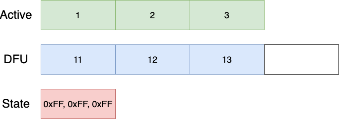
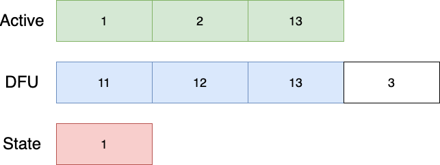
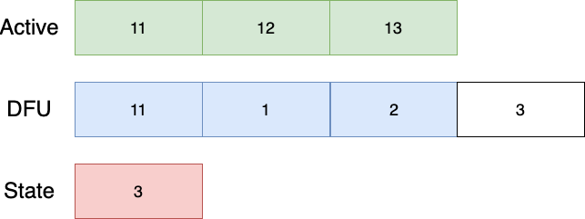
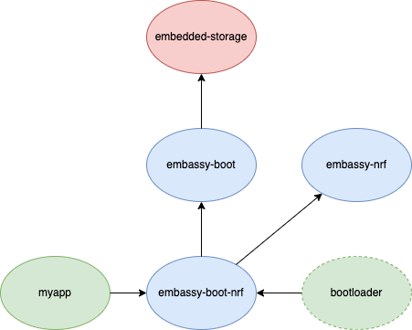

+++
title = "Firmware updates, part 1: Bootloader"
extra.author = "lulf"
+++

This is the first post in a series about doing device firmware updates (DFU) over the air (OTA) and continuous delivery of firmware for embedded devices. We'll explore the different parts of a complete end-to-end system with this capability.

This post will be about a fundamental component in such a system: the bootloader.

<!-- more -->

# Background

For a connected devices to be maintainable at scale, they must be able to update themselves just like any other software. However, managing a fleet of occasionally connected devices with little bandwidth requires a different approach to delivering software updates to regular applications. One goal for Drogue IoT is to support the entire software update workflow on tiny devices, all the way from building your firmware to delivering it to the device, just like any other modern application.

# Bootloader

A fundamental component in an updatable system is the ability to boot different versions of an application. Making a generic bootloader is hard, because there is a large number of different possible device configurations. The complexity and size of a bootloader is also determined by its functionality: a bootloader being able to retrieve firmware from a network has a bigger footprint than one that only loads an application from a fixed location in flash.

Since we're focused on IoT, we can assume that our devices have some form of network connectivity, but we do not wish to tie ourselves to any specific connectivity type. 

Moreover, for many applications, it's desirable to retrieve the updates while the application is running, which excludes some bootloader designs that do the firmware update within the bootloader. Given some connectivity strategies may be slow, this may result in an exceedingly long time not executing the application itself.

What happens on power failure while updating? With devices installed in hard-to-reach locations, it is important that we can gracefully handle such a scenario and fall back to an existing version and try again. Likewise, should the new application not work properly, we want to allow falling back to the previous version known to work.

Finally, we want to be able to store firmware in external flash, which has potentially different page and transfer sizes than the internal on-chip flash.

# Introducing embassy-boot

After thinking about the above requirements and exploring existing bootloaders, we decided to write a bootloader made for [embassy](https://embassy.dev/), with inspiration from other attempts in the Rust community. The goal was to write a bootloader that met both the above requirements and that would benefit the entire Rust embedded community.

The result of that work now lives in [embassy-boot](https://github.com/embassy-rs/embassy/tree/master/examples/boot/nrf). The `embassy-boot` bootloader is a lightweight bootloader supporting firmware application upgrades in a power-fail-safe way, with trial boots and rollbacks. 

The bootloader consists of two parts, a platform independent part and a platform dependent part. The platform independent part is a standard Rust library (and there are unit tests using an in-memory 'flash' for testing correctness) that can be used to build your custom bootloader. The platform-dependent part ties the generic library to a specific hardware platform, such as nRF or STM32. This provides some hardware-specific functionality, for instance integration with nrf-softdevice or a watchdog timer for nRF devices.

NOTE: Do I need to use embassy with `embassy-boot`? Absolutely not! `embassy-boot` just happens to use embassy internally for the platform dependent parts. The application side uses async APIs to write firmware (preventing you blocking other tasks while writing firmware to flash), but does not require any specific runtime or HAL, as long as it implements the `embedded-storage` interface.

The bootloader flash memory is divided into logical areas named `Partitions`:

<figure>
    
    <figcaption>Bootloader partitions</figcaption>
</figure>

Each partition is an area of flash on a microcontroller, but only the `Bootloader` and `Active` partitions need to be on the same physical flash storage. This means you can use off-chip flash to store the firmware update if desired.

The `Bootloader` partition contains the bootloader application itself, usually around 8kB if disabling debug logging. The `Bootloader State` partition contains a flag indicating if firmware within the `Active` and `DFU` partitions should be swapped or not, as well as a progress index used by the swap and revert algorithm.

The `Active` partition contains the currently running firmware, and the bootloader will always jump to the application at the start of the `Active`  partition. The `DFU` partition contains the "next" firmware to be updated, until the update is signaled, at which point the bootloader will gradually swap it with the "old" firmware.

## Initial boot

At initial boot, the bootloader performs the following operations:

1. Read current bootloader state magic word.
1. If no "SWAP" magic bytes found, boot the current firmware.
1. If "SWAP" magic bytes found, perform the swap between the Active and DFU firmwares.
1. Boot the new current firmware.

## Updating the firmware

An application that wants to be capable of firmware update will need to create an instance of a `FirmwareUpdater`. This is provided by the `embassy-boot` library, with defaults available if using the `embassy-boot-nrf` or `embassy-boot-stm32` libraries. The `FirmwareUpdater` is capable of the following operations:

* Write firmware to any offset within the `DFU` partition.
* Mark the current running firmware as 'OK', to prevent a firmware rollback.
* Mark the current firwmare to be swapped by the new firmware.

To create an updater instance with configuration from linker script:

```rust
let mut updater = FirmwareUpdater::default();
```

How the firmware gets to the device is not the responsibility of the `FirmwareUpdater`, which leaves this problem to the application itself. In the next blog post, we will cover different ways you can get the firmware to the device.

To write a firmware block to flash (data must meet the alignment requirements of the flash instance you're providing):

```rust
updater.write_firmware(offset, &[0, 1, 2, 3], &mut flash).await
```

This allows you to write firmware in smaller pieces at a time, which might be necessary for constrainted devices.

Once the new firmware is written, it is marked to be swapped with the current firmware by invoking the `update` method:

```rust
updater.update(&mut flash).await
```

Once returned, the application needs to reset the device. Upon reset, the device will enter the bootloader once again, and attempt to swap the firmware before booting the next version.

NOTE: By structuring your application accordingly, you may update the firmware in parallel while running other tasks. This reduces the downtime of your application to a minimum.

## Swap algorithm

At the core of the bootloader is the partition swapping algorithm, which is not tied to any specific platform. The algorithm is based on earlier work by Dario Nieuwenhuis (who created the embassy project) and extended so support more configuration. The algorithm keeps an internal state of the copy progress in flash, using 1 word per index value which ensures that only a single erase is needed before starting the swap process, as opposed to erase + write for every index counter update.

Lets assume a flash size of 3 pages for the Active partition, and 4 pages for the DFU partition. The swap index contains the copy progress, as to allow detecting if copy is completed or not on power failure. The index counter is represented within 1 or more pages (depending on total flash size), where a page X is considered swapped if index at location (X + WRITE_SIZE) contains a non-erased value. This ensures that index updates can be performed atomically and avoid a situation where the wrong index value is set (page write size is "atomic").

The initial state of the Active, DFU and State partitions are shown below:

<figure>
    
    <figcaption>Initial State</figcaption>
</figure>

The `State` partition is only showing the index for the `Active` partition for simplicity. The algorithm starts by copying 'backwards', and after the first step, the layout is as follows:

<figure>
    
    <figcaption>Copy State 1</figcaption>
</figure>

The next iteration performs the same steps:

<figure>
    
    <figcaption>Copy State 2</figcaption>
</figure>

And again until we're done:

<figure>
    
    <figcaption>Final State</figcaption>
</figure>

The reverting algorithm uses the swap index to check if images were swapped, or that the application failed to mark the boot successful. In this case, the revert algorithm will
run.

The revert index is located separately from the swap index, to ensure that revert can continue on power failure.

Another thing to note is that the revert algorithm works forwards, by copying into the 'unused' DFU page at the start.

Once the swap process is complete, the bootloader may jump to the application at the beginning of the active partition.

This is a platform-specific step done in the `embassy-boot-stm32` or `embassy-boot-nrf` part of the bootloader.

NOTE: The new application is responsible for marking itself as successfully booted, otherwise the bootloader will attempt to revert to the previous application when restarted!

The application marks itself as successfully booted by invoking `mark_booted`:

```rust
updater.mark_booted(&mut flash).await
```

### Power fail safety

What happens if the swap process is interrupted during the copy? Can we still revert back to the old version in a half-copied state? Yes! After a power failure, the device may be in one of the following states during the update process:

* Firmware has been written, but not instructed to update. In this case, no action is taken and the old firmware will be used.
* Should swap, but swap is not complete. In this case, the bootloader will continue the swap operation from where it left off. The crucial step in this process is that the page copy progress state is written atomically.
* Swap is complete, but is still instructed to update. In this case, the bootloader will assume that something went wrong with the new application and will start to revert to the previous application.
* Should revert, but revert is not complete. Similar to the previous state, the revert process will continue where it left off until complete.

## Rolling back

So your application got updated, but you had a bug in your application causing it to crash! Now what? Well, there are a few key principles that should be met within your application to ensure that you don't get 'stuck'. On a reset, the bootloader will take care of swapping back the existing firmware, so make sure that:

* In the event of an unrecoverable error, panic! Make sure you use a panic handler that allows your device to reset and start over (causing the bootloader to roll back).
* Your application is running correctly before marking itself as successfully booted. Doing this too early could cause your application to be stuck with the new faulty firmware.

For IoT connected devices, there is an additional trick: make sure you can connect to the required services (such as the firmware update service) before marking the firmware as successfully booted. This increases the chance you will be able to recover and fix bugs by rolling out a new version of your firmware. We'll cover this in future blog posts of this series.


## Bootloader and application binaries

The bootloader may be used as a library or as a standalone binary. In the case where it's used as a standalone binary, it must be compiled with the linker script setting the partition boundaries. If you require a high degree of customization, you can use it as a library and provide the partitions programatically.

The application binary can depend on the platform dependent bootloader library for convenience, which will also use the linker script to derive the partition boundaries. In the same way as for making a customized bootloader, you can define the partition boundaries programatically for your application as well.

A typical dependency graph of an application `myapp` using `embassy-boot` is shown below:

<figure>
    
    <figcaption>Bootloader Dependencies</figcaption>
</figure>

### Application linker script

The linker script defines the partition boundaries. It is only needed if you don't want to define the partition limits in code. A linker script may look like this for an nRF52 application:

```
MEMORY
{
  /* NOTE 1 K = 1 KiBi = 1024 bytes */
  BOOTLOADER                        : ORIGIN = 0x00000000, LENGTH = 24K
  BOOTLOADER_STATE                  : ORIGIN = 0x00006000, LENGTH = 4K
  FLASH                             : ORIGIN = 0x00007000, LENGTH = 64K
  DFU                               : ORIGIN = 0x00017000, LENGTH = 68K
  RAM                         (rwx) : ORIGIN = 0x20000008, LENGTH = 32K
}

__bootloader_state_start = ORIGIN(BOOTLOADER_STATE);
__bootloader_state_end = ORIGIN(BOOTLOADER_STATE) + LENGTH(BOOTLOADER_STATE);

__bootloader_dfu_start = ORIGIN(DFU);
__bootloader_dfu_end = ORIGIN(DFU) + LENGTH(DFU);
```

The BOOTLOADER section is not strictly necessary but shown for documentation purposes. The locations starting with `__bootloader*` are read by the `FirmwareUpdater` default initialization code to learn the partition limits. Note that the `Active` partition is not known by the `FirmwareUpdater` but is effectively the `FLASH` region as defined in the above linker script.

### Bootloader binary 

The bootloader binary itself is only concerned with initializing peripherals and the bootloader before loading the application. 

The standard out of the box bootloader application looks like this:

```rust
#[entry]
fn main() -> ! {
    // Initialize the peripherals
    let p = embassy_nrf::init(Default::default());
    
    // Setup flash used to store firmware
    let mut flash = Nvmc::new(p.NVMC);

    // Create bootloader using partition limits derived from linker script
    let mut bl: BootLoader = BootLoader::default();
    
    // Prepare the bootloader for launching the application, performs necessary swap or rollback operation depending on the internal state.
    // You can provide your own FlashProvider implementation if you want to use separate flash for Active, DFU and State partitions.
    let start = bl.prepare(&mut SingleFlashProvider::new(&mut flash));

    // Ensures flash is dropped again before launching application
    core::mem::drop(flash);
    
    // Load application (fingers crossed)
    unsafe { bl.load(start) }
}
```

### Bootloader linker script

The linker script defines the partition boundaries. It is only needed if you don't want to write your own bootloader binary. A linker script may look like this for an nRF52 application:

```
MEMORY
{
  /* NOTE 1 K = 1 KiBi = 1024 bytes */
  FLASH                             : ORIGIN = 0x00000000, LENGTH = 24K
  BOOTLOADER_STATE                  : ORIGIN = 0x00006000, LENGTH = 4K
  ACTIVE                            : ORIGIN = 0x00007000, LENGTH = 64K
  DFU                               : ORIGIN = 0x00017000, LENGTH = 68K
  RAM                         (rwx) : ORIGIN = 0x20000008, LENGTH = 32K
}

__bootloader_state_start = ORIGIN(BOOTLOADER_STATE);
__bootloader_state_end = ORIGIN(BOOTLOADER_STATE) + LENGTH(BOOTLOADER_STATE);

__bootloader_active_start = ORIGIN(ACTIVE);
__bootloader_active_end = ORIGIN(ACTIVE) + LENGTH(ACTIVE);

__bootloader_dfu_start = ORIGIN(DFU);
__bootloader_dfu_end = ORIGIN(DFU) + LENGTH(DFU);
```

The difference to the application linker script is minimal. The `FLASH` region is now in the bootloader region. The `Active` partition boundaries are also required to be known by the bootloader.

## Portability

As we've seen above, only a small amount of code is required to write your own bootloader using `embassy-boot`. Extending to new hardware platforms within the STM32 family requires adding a working flash driver for that chip, at which point the `embassy-boot-stm32` library should work with that particular family. For different chip vendors and architectures like RISC-V, creating another `embassy-boot-riscv` would be needed, but still the amount of hardware-specific code should only be related to setting up peripherals and providing the correct boot process for that hardware.

## Examples

To get started using `embassy-boot`, you can find ready-made examples in [embassy](https://github.com/embassy-rs/embassy/tree/master/examples/boot) for several chips. If you have a board that is not listed, reach out in the [embassy chat](https://matrix.to/#/#embassy-rs:matrix.org) or contribute an example yourself.

We also have a demonstrating the use of `embassy-boot` and a firmware update tool:

[](https://youtu.be/ISw7jcJdtBM)

## Alternatives

There are many existing bootloaders, like [mcuboot](https://www.mcuboot.com/), which probably has the best device and feature support. However, building and running a C based bootloader and adapting it to work with `embassy` is also not as nice as using Rust tooling and being able to reuse the hardware support already in embassy. 

Another bootloader with a similar approach to `embassy-boot` is [moonboot](https://jhbruhn.de/posts/moonboot/), which shares a similar design with a split responsibility between the bootloader and application but is even more generic (not tied to embassy, but also means more work to use) and (at the time of writing) not power fail safe. Clearly there is an opportunity for collaboration in the future.

# Future work

* Adding support for more hardware platforms. At present, the nRF52 and STM32 platforms are supported, but not all STM32 families have a working flash driver. Supporting hardware like the Raspberry Pi Pico is also on the wish list.
* Firmware verification. Being able to install a trusted public key in the bootloader that can be used to verify a firmware signature before swapping/booting.
* Additional bootloader capabilities such as having a fail safe partition with 'factory settings' in case reverting fail.

# Summary

In this first post in a series, we have looked at the fundamental microcontroller component required to support firmware updates. We first had a look at the features required from a bootloader, and then had a look at the newly created `embassy-boot`and learned how it swaps firmware. Finally we've discussed what it means to be power safe and how `embassy-boot` ensures that application updates are reliable, with some delegation of that responsibility of the application to mark itself as 'OK'.


In the next blog post, we will have a look at different mechanisms for getting the firmware onto the device itself.

