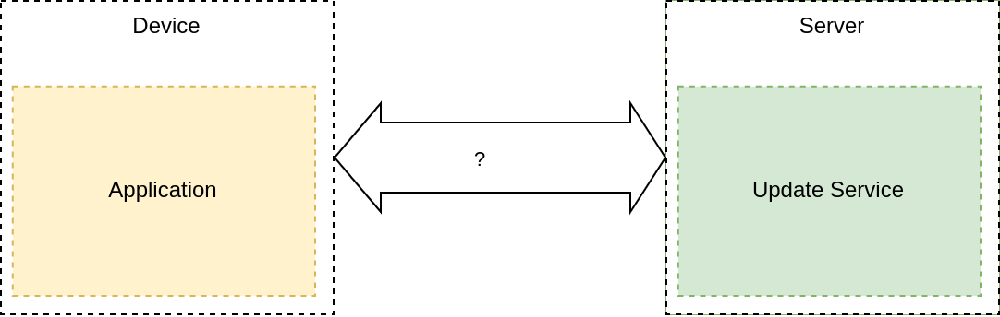
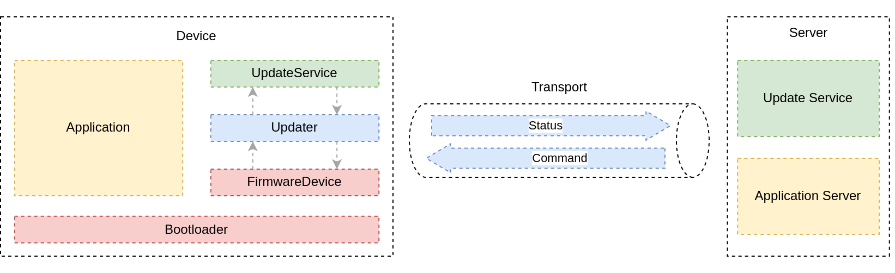

+++
title = "Firmware updates, part 2: Transporting the update"
extra.author = "lulf"
+++

This is the second post in a series ([part 1](https://blog.drogue.io/firmware-updates-part-1/), [part 3](https://blog.drogue.io/firmware-updates-part-3)) about doing device firmware updates (DFU) over the air (OTA) and continuous deployment of firmware for embedded devices. We'll explore the different parts of a complete end-to-end system with this capability.

This post will be about the different networks and how you can manage firmware updates using them.

<!-- more -->

# Background

In the [previous post](https://blog.drogue.io/firmware-updates-part-1/), we explored the bootloader component required to do firmware updates in a power fail-safe way. Now that we've got a working bootloader, let's take a look at how we can get the firmware on the device itself.

<figure>
    
    <figcaption>Target system</figcaption>
</figure>

It is assumed that there is some kind of update service that the device communicates with. This could be a direct connection in the network, or via a gateway. In this article we'll have a look at some widely used alternatives:

* WiFi/Ethernet/LTE-M
* LoRaWAN
* BLE (Bluetooth Low Energy)
* Serial/UART

Some of these can easily be adapted to a IPv4/IPv6-based network, and may therefore run directly on the embedded devices. Others like BLE require a custom component to translate between the GATT services and the IP network. For BLE and serial, one can use the `drgdfu` library and tool for this purpose. For LoRaWAN, integration with the network provider such as [TTN](https://www.thethingsnetwork.org/) handles the forwarding of data to/from the update service.

## IP-based

If your devices has WiFi and/or Ethernet capabilities, then talking to the server becomes a lot easier. The downsides are power usage and range (WiFi) or the need for using wires (Ethernet). Even so, you might need a TCP/IP implementation. Many WiFi adapters already provide a TCP/IP implementation which you interact with using [AT commands](https://www.espressif.com/sites/default/files/documentation/4b-esp8266_at_command_examples_en.pdf). [Drogue Device](https://github.com/drogue-iot/drogue-device) contains drivers for the [ESP8266](https://en.wikipedia.org/wiki/ESP8266) and [eS-WiFi](https://www.inventeksys.com/es-wifi-support/) that you can use with [embassy](https://embassy.dev/). 

In the cases where you don't have a TCP/IP implementation, you can use an open source implementation. In the C world, there is [LwIP](https://savannah.nongnu.org/projects/lwip/), but in the world _we_ care most about (Rust), there is [smoltcp](https://github.com/smoltcp-rs/smoltcp). 

## LoRaWAN

LoRaWAN is a wide area wireless protocol for devices that infrequently sends sensor data. Devices consume little power and transmit data over long distances compared to WiFi or BLE. However, LoRaWAN networks also have bandwidth limitations. For instance, doing a 64kB firmware update using the [TTN free tier](https://www.thethingsnetwork.org/) network would take 4 days! Things look a bit better if running your own network, but you'll still be limited by regulated bandwith usage and the lower limit is 4 hours for 64kB.

The being said, spending 4 hours or 4 days to update firmware of IoT sensors might not be problem for many applications, and as long as the update service supports such a low pace, it works as expected.

## LTE-M / NB-IoT

LTE-M/NB-IoT device consume more power than LoRaWAN devices. On the other hand, the network coverage and bandwidth is a lot higher. With LTE-M you can get up to 1 mbit downlink speeds (under ideal conditions!), which allows you to quickly download firmware when there is an update. These devices often contains a TCP/IP implementation allowing you to connect directly to firmware update services. If you can live with the higher power usage and the additional cost (as it usually involves a montly subscription to the provider), this option can be a good way to ensure you have firmware update capability for your device.

We don't have any examples for LTE-M / NB-IoT at present, but in general the approach would be similar to IP based networks. Have a look at [this repository](https://github.com/titanclass/thingy91-lorawan-nbiot/) for an example sending data over LTE-M/NB-IoT.

## BLE / Thread / ZigBee

These standards are designed to work well with low power devices, but with limited range and not directly interoperable with an IP network (6LoWPAN allows that, but it is IPv6 only and not widely supported). Because of that, they need a gateway component to reach the internet. 

For BLE, there is no standard firmware update GATT service UUID defined, so a custom service must be defined.

## Serial

The good old serial interface is a simple but flexible way to upload firmware. The downside of serial is of course that it is wired, but it can be a nice 'fallback' for cases where you need to go on site anyway as it's reasonably fast and efficient.

## Introducing embedded-update

For devices that can connect directly to the network and maps well to a "pull" model for retrieving firmware updates, we've created the [embedded-update](https://crates.io/crates/embedded-update) crate. `embedded-update` defines a firmware update protocol than can be plugged in to different firmware update services and update capable devices. It performs the firmware update process using implementations for the `UpdateService` and `FirmwareDevice` traits from the application. 

<figure>
    
    <figcaption>Overview of embedded-update</figcaption>
</figure>

At the time of writing, `drogue-device` contains an implementation of `UpdateService` for [Drogue Cloud](www.drogue.iot), and an implementation of `FirmwareDevice` based on `embassy-boot`. For the full example, have a look at [this STM32L4 (WiFi) example](https://github.com/drogue-iot/drogue-device/tree/main/examples/stm32l4/iot01a/wifi).

Let's look at an example using `embedded-update` with Drogue Cloud and the [embassy-boot](https://github.com/embassy-rs/embassy) bootloader.

The firmware revision is embedded into the firmware by reading it from the environment at build time:

```
const FIRMWARE_VERSION: &str = env!("CARGO_PKG_VERSION");
const FIRMWARE_REVISION: Option<&str> = option_env!("REVISION");
```

By default, it will use the version specified in the `Cargo.toml`, but this can be overridden by setting the `REVISION` environment variable during build. As mentioned in the [previous article](https://blog.drogue.io/firmware-updates-part-1/), an instance of the updater that writes to flash is created:

```
let updater = embassy_boot_stm32::FirmwareUpdater::default();
```

The updater will read partition settings from the predefined locations supplied by the linker scripts. The next step is to 
create an instance of the `FirmwareDevice`. As mentioned earlier, an instance of this trait exists that wraps the types from `embedded-storage` and `embassy-boot`.

```
let version = FIRMWARE_REVISION.unwrap_or(FIRMWARE_VERSION);
let mut device: FirmwareManager<Flash, 2048, 256> = FirmwareManager::new(flash, updater, version.as_bytes());
```

The `FirmwareManager` ensures that writes to the flash are done in page size chunks, configurable using the const generics.

Next we need to create an instance of the `UpdateService` we want to use. There are several options here, but in this case we are using [Drogue Cloud](https://github.com/drogue-iot/drogue-cloud) directly, in which case we can use the `DrogueHttp` update service, which uses HTTPS with the Drogue Cloud endpoints:

```
let service: DrogueHttpUpdateService<'_, _, _, 256> = DrogueHttpUpdateService::new(
    network,
    rng,
    SocketAddr::new(IpAddr::new(65, 108, 135, 161), 443),
    "http.sandbox.drogue.cloud",
    "device1@example-app",
    "hey-rodney"
);
```
The `network` instance is any type implementing the `TcpClient` trait from `embedded-nal-async`, so you can use this client with different TCP implementations. The `rng` is used by `embedded-tls` when establishing the TLS connection to Drogue Cloud.

Now that we have both an implementation for the `UpdateService` and `FirmwareDevice`, we can create and invoke the `FirmwareUpdater` which performs the update protocol together with these two:

```
let mut updater = embedded_update::FirmwareUpdater::new(
    service,
    embedded_update::UpdaterConfig {
        timeout_ms: 40_000,
        backoff_ms: 100,
    },
);
```

The `UpdaterConfig` contains two configuration options to tune the timeout and retry behavior:

* `timeout_ms` - the timeout to give the request passed to the update service before retrying.
* `backoff_ms` - the number of milliseconds to wait before retrying a failed or timed out request.

Finally, we create a task that runs the updater that runs in parallel with the rest of the application:

```
#[embassy::task]
async fn updater_task(...) {
    ...
    loop {
        match updater.run(&mut device, &mut Delay).await {
            Ok(s) => {
                match s {
                    DeviceStatus::Updated => {
                        defmt::debug!("Resetting device");
                        cortex_m::peripheral::SCB::sys_reset();
                    }
                    DeviceStatus::Synced(delay) => {
                        if let Some(delay) = delay {
                            Timer::after(Duration::from_secs(delay as u64)).await;
                        } else {
                            Timer::after(Duration::from_secs(10)).await;
                        }
                    }
                }
            }
            Err(e) => {
                defmt::warn!("Error running updater: {:?}", e);
                Timer::after(Duration::from_secs(10)).await;
            }
        }
    }
}
```

A single run of the updater returns an `DeviceStatus` which is an enum with two variants:

* `DeviceStatus::Synced(Option<u32>)` - returned when the firmware is up to date and marked as 'successfully booted'. In this case, the application is free to re-run the updater at a later time, as an optional u32 with the amount of seconds it should wait.
* `DeviceStatus::Updated` - returned when the firmware updater process is complete. In this case, the application is responsible for resetting the device so that the new firmware can be swapped.

With that, we have a continuously running update process in our application, that can run together with other tasks in the application.

Similar to the IP based example, we can use the same `embedded-update` crate to enable firmware updates for our lorawan device. An implementation of the `UpdateService` for LoRaWAN is provided in [`drogue-device`](https://github.com/drogue-iot/drogue-device).

In addition, the `embedded-update` crate provides a `Serial` implementation of the `UpdateService` trait that works with traits from `embedded-io` and using `postcard` with a fixed-frame format. This way, the protocol can be used not only for serial, but also USB, TCP and UDP if desired. Likewise, a `Serial` implementation of the `FirmwareDevice` trait is also provided, allowing you to use `embedded-update` on both sides of the link.

## Updating BLE devices

With BLE, a "push" model for firmware is more appropriate because the BLE peripheral acts as the server. For this case, we have implemented a `FirmwareService` using the `nrf-softdevice` crate supported by the nRF52 chip families:

<figure>
    
    <figcaption>Updates over Bluetooth Low Energy (BLE)</figcaption>
</figure>

The actual GATT service definition looks like this:

```rust
// The FirmwareUpdate GATT service
#[nrf_softdevice::gatt_service(uuid = "00001000-b0cd-11ec-871f-d45ddf138840")]
pub struct FirmwareService {
    /// Version of current running firmware
    #[characteristic(uuid = "00001001-b0cd-11ec-871f-d45ddf138840", read)]
    version: Vec<u8, 16>,

    /// Max firmware block size for device
    #[characteristic(uuid = "00001002-b0cd-11ec-871f-d45ddf138840", read)]
    mtu: u8,

    /// State control
    #[characteristic(uuid = "00001003-b0cd-11ec-871f-d45ddf138840", write)]
    control: u8,

    /// Version being written
    #[characteristic(uuid = "00001004-b0cd-11ec-871f-d45ddf138840", write, read)]
    next_version: Vec<u8, 16>,

    /// Current write offset
    #[characteristic(uuid = "00001005-b0cd-11ec-871f-d45ddf138840", read)]
    offset: u32,

    /// Firmware data to be written
    #[characteristic(uuid = "00001006-b0cd-11ec-871f-d45ddf138840", write)]
    firmware: Vec<u8, 64>,
}
```

The service expose settings that are relevant to the firmware update process:

* `version` - the current version running on the device.
* `mtu` - the preferred block size to transfer over the BLE link.
* `control` - a control signal for setting the expected state on the device.
* `next_version` and `offset` - contains the current version being written and the next expected offset.
* `firmware` - the characteristic where the payload for the next offset is written.

The `drgdfu` tool implements a `GATT` client for interacting with this service, whereas `drogue-device` provides an implementation that adapts the above service to a `FirmwareDevice` trait from `embedded-update` as shown in the overview diagram. You can thus update the firmware of your device from a file by running:

```
drgdfu upload ble-gatt --device ED:38:1E:3E:99:B6 --enable-discovery file --firmware update.bin --metadata update.json
```

You can also update the device from `Drogue Cloud` by running:

```
drgdfu upload ble-gatt --device ED:38:1E:3E:99:B6 --enable-discovery cloud --http https://http.sandbox.drogue.cloud --application example-app --device ble-gateway --password hey-rodney
```

This requires setting up `Drogue Ajour` on the server side to manage the firmware, which we'll cover in the next article in this series.

# Summary

We've compared the different options for connecting devices to a firmware update server, and the considerations that need to be taken for each. The `embedded-update` crate implements a firmware update protocol that can work with update services that follow as similar "pull model". However, for some devices like BLE, an additional component is needed in between that defines a custom protocol for doing the update.

## Next steps

As mentioned earlier, some of the implementations for the `embedded-update` traits are still located in `drogue-device`. Once `embedded-nal-async` stabilizes, we'd like to move these implementations to `embedded-update`. There are also other update services that would be interesting to integrate with, and implementing one for `Eclipse Hawkbit` is high on the todo list.

If you are building your own service or are using existing services that you would like to see supported in `embedded-update`, reach out to us in the chat or on GitHub! Likewise, if you have devices that do not work with the current `embedded-storage` and `embassy-boot` based device, we are more than happy to extend the capabilites in `embedded-update`.

In the [next](https://blog.drogue.io/firmware-updates-part-3/) and final article in the series, we'll look at how you can manage firmware and automatically deploy them to devices using Drogue Cloud.
