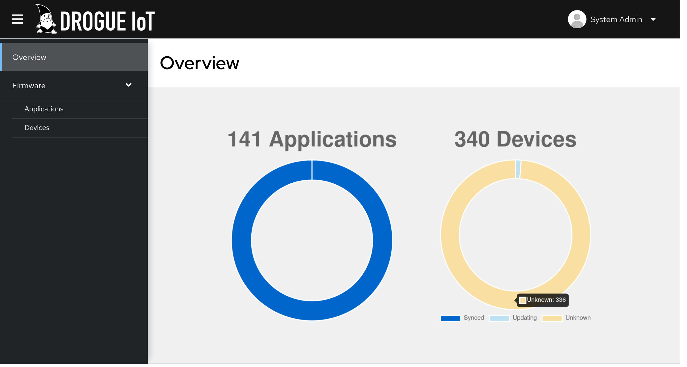
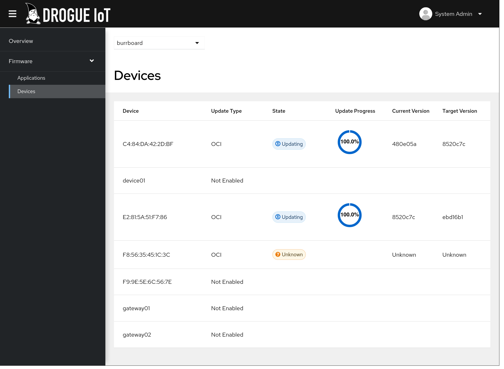

+++
title = "Drogue Cloud: Release 0.10.0"
extra.author = "ctron"
description = "Drogue Cloud 0.10.0 has improved MQTT, new device events, more powerful Helm charts, more TLS, and much more additional improvements."
+++

For this release, we had a focus on improving existing functionality. Mostly extending what was already there, but
lacked a few features, knobs to tweak, or as postponed in previous releases. And yes, we fixed a few bugs too. 

<!-- more -->

## MQTT improvements

MQTT received a few major improvements. One of them is the support for QoS 1, which now works with the MQTT integration,
down to Kafka.

On the device side, we extended the MQTT endpoint to track the device connection state across MQTT endpoints. By
introducing a device state service, we can now handle connection stealing and connection events properly. This gives
you the information when devices connect and disconnect through the normal Kafka channel. This even works when pods
go down.

## Events

In combination with the new connection events, added device registry change events to the data stream. This will give
you change events from the device registry for devices, coming through the regular data stream in Kafka. And with that
also using MQTT and WebSockets.

For this we added two new event types, so that you can filter and process them accordingly.

This allows you to build custom integrations, reconciling with external systems, without being part of the Drogue Cloud
infrastructure yourself.

## The S in IoT

There is always something to improve when it comes to security. For example the OAuth2 token, which can be used to
authenticate the user on the WebSockets integration. So far, we validated them during the connection establishment phase,
but those tokens normally do have an expiration time. Once that passed, the token is no longer valid. For protocols like
HTTP this is simple, as the token is sent with every request. But for connection oriented protocols, like WebSockets,
the question is: what should be done once the token expired.

Well, starting with this release, we do close the connection. Sounds a bit dramatic? Well, you should have some logic
in place anyway, which re-opens the connection. However, in order to avoid that, we also added the ability to send
a message to the server side, sending a refreshed token. As long as that is valid, the connection will stay open. Of
course, you can also use access tokens, issues by Drogue Cloud.

We also enabled all internal services to work with TLS. You can argue that internal services don't need that, and that
issues tons of certificates can be a hassle. However, using e.g. the OpenShift service CA, this become pretty easy and
automated. So why not leverage that, and allow for custom certificates in addition. Yes, you still can use unencrypted
connections too.

## Firmware management for Drogue Device

In Drogue Device, we have the ability for flash a new firmware, even while the device is running. This is great, but
you also need some way to actually deliver updates like that. For this we created a firmware update service, which
is based on the infrastructure that Drogue Cloud provides. It can actually be seen as one of those "custom application",
which makes use of the infrastructure, to connect some application to its devices.

However, in this case, it feels a bit less custom and much more generic. So we decided to give it its own place:
[drogue-ajour](https://github.com/drogue-iot/drogue-ajour).

Drogue Ajour is a service, which defines an update protocol, and provides ready-to-use implementations for
Drogue Device. It also interfaces with existing sources for updates, like the
[Open Container Initiative](https://opencontainers.org/) (OCI) or [Eclipse hawkBit](https://www.eclipse.org/hawkbit/).

We will tell you more about Ajour in a future blog post, but just to get you excited: Think about creating a
[Tekton](https://tekton.dev/docs/concepts/overview/) build pipeline, uploading your firmware blob to a container
registry (like [Quay](https://quay.io/) or [GHCR](https://ghcr.io)) and have it delivered to your devices. Tracking
the progress along the way:

And of course, with the hawkBit integration, you can do the scheduling through the external system. 

## Exploring the edge

We also did an early proof-of-concept with [Open Cluster Management](https://open-cluster-management.io/). We created an
addon, which allows to bridge Drogue Cloud with OCM, syncing device workload to the edge, using Kubernetes resources.
True, this is in a very early state. But [check it out](https://github.com/ctron/drogue-cloud-ocm-addon), if you are
feeling adventurous.

So in the future, you might be able to just "configure OPC UA" for a device, and this will spin up the OPC UA bridge,
on the device, to deliver data right to your data channel.

## Wait, there is more

We migrated to the newest Keycloak version, which is now based on Quarkus, consuming less resources, and brining a new
operator at the same time. That was a pretty complex migration, but we are glad that we are on the bleeding edge of
Keycloak again. Future upgrade should be much easier now.

Of course, we also upgraded a lot of dependencies, and Rust, but also our base container images. These are now based
on UBI9/RHEL 9.

There are also our Helm charts. We are operating our [public sandbox for over a year](https://blog.drogue.io/release-030/)
now. Deploying it for around a year now using Helm and ArgoCD, in a GitOps style. And it works great.

However, we also found out that we are missing lots of knows and abilities to tweak the deployment. So we did add a lot
of new knobs, that can help you tweak the deployment using the existing charts. While at the same time, restructuring
the charts to reduce their complexity. To be honest, this is an ongoing process, but it also is a huge improvement in
this release.

The `drg` command line tool also received a major overhaul. Re-using the existing client library, and bringing a new
commands in the process. It also supports machine-readable output through JSON now, so that you can start writing shell
scripts working with the Drogue Cloud system.

## What's next

You might have noticed, the topic of digital twin was missing in this release. This is still on our roadmap! However,
to be honest, we aren't fully sure in which direction to head with this. So, it will simply take a bit longer than
expected. But we want to get it right. However, we progressed a bit with the proof-of-concept, encrypting IoT payload
end-to-end (device to digital twin), might be worth taking a look.

A point to focus on will also be our documentation. Drogue Cloud can do a lot more than we advertise, and we need to
change this. This might also include some more workshops, but definitely the documentation needs to be enhanced, to
explain what is already available.

We will definitely continue with our edge integration efforts. Alongside Open Cluster Management, which is intended, as
the name says, for clusters, we also want to explore the use of [Project Flotta](https://project-flotta.io/). Flotta
is designed for small footprint devices on the edge, which might be quite a good fit for IoT workloads on the edge.

## Also see

* [Releases](https://github.com/drogue-iot/drogue-cloud/releases)
* [Public sandbox](https://sandbox.drogue.cloud)
  * [Firmware management](https://firmware.sandbox.drogue.cloud)
* [Drogue Ajour](https://github.com/drogue-iot/drogue-ajour)
* [Drogue IoT OPC UA agent](https://github.com/drogue-iot/drogue-opcua-agent-rust)
