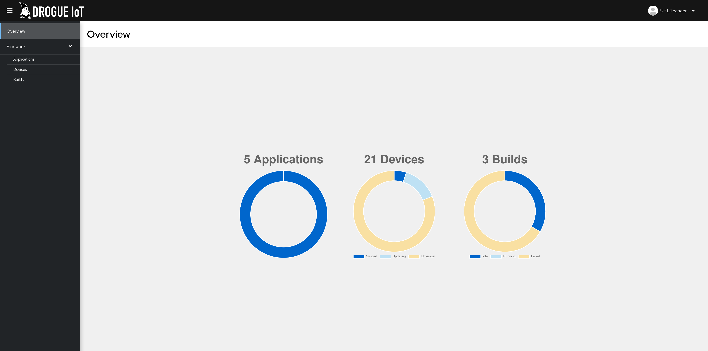
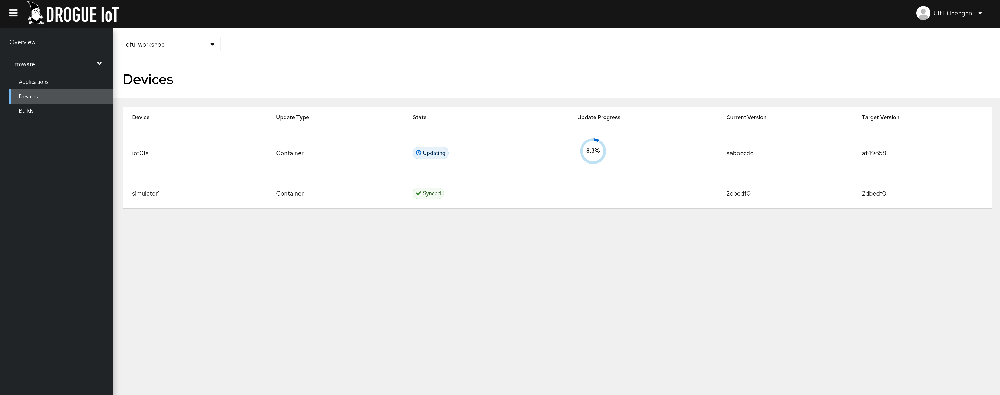
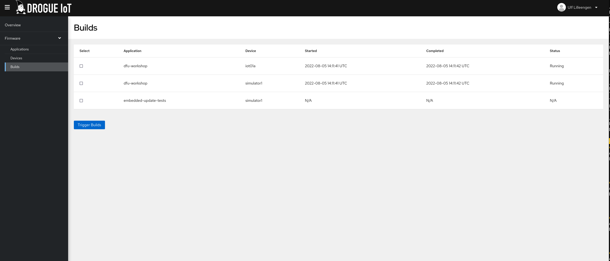

+++
title = "Firmware updates, part 3: Firmware Delivery and Building"
extra.author = "lulf"
+++

This is the third post in a series about doing device firmware updates (DFU) over the air (OTA) and continuous deployment of firmware for embedded devices. We'll explore the different parts of a complete end-to-end system with this capability.

This post will be about how firmware is delivered to devices and how to build a continuous delivery pipeline using Drogue IoT.

<!-- more -->

# Background

In the [previous post](https://blog.drogue.io/firmware-updates-part-2/), we explored the ways which you can transport the firmware onto devices across different transports.

Now we're going to look at the final steps: building and delivering the firmware, based on the update protocol defined by [`embedded-update`](https://github.com/drogue-iot/embedded-update).

Supporting firmware updates in Drogue Cloud is something we've been thinking about for a while, since it's a common piece of any IoT infrastructure. There are many ways to distribute software, but there are a few special properties important when dealing with tiny IoT devices:

* Unreliable connectivity - embedded devices may not be able to retrieve the entire firware in one go
* Protocol support - embedded devices can connect to Drogue Cloud using different protocols
* Low footprint - bandwidth may be limited, therefore the update protocol messages must be small


The first thought was to offload this functionality to an existing project like [Eclipse Hawkbit](https://www.eclipse.org/hawkBit). The update protocol of Eclipse Hawkbit is stateless and allows devices to fetch firmware in chunks. The downside is that Eclipse Hawkbit update service only supports HTTP with a JSON protocol, not really suitable for tiny devices. 

With the telemetry and command API of Drogue Cloud, we have all the building blocks needed to transport the firmware. So instead of using Hawkbit directly, we can define an update protocol using Drogue Cloud connectivity as a transport and use the Drogue Cloud integration APIs to define a update service. This unlocks some interesting use cases:

* Firmware update service can stay in a private network
* Integrate with different update services, including Eclipse Hawkbit
* Update devices over any protocol supported by Drogue Cloud

Moreover, one of the things we've learned in our experimentation with Rust on embedded devices, is that if feels like writing software running on a server. What if we could apply the same mechanisms and tooling we use for building "normal" software to firmware for embedded devices? On Kubernetes, projects like [Tekton](https://tekton.dev) allow you to declaratively define a CI/CD pipeline that builds software using container images. Moreover, most Kubernetes clusters have access to a container registry, used to store software in container images. In addition to storing firmware in third party systems such as Eclipse Hawkbit, what if we used the container registry to store firmware as well?

To handle firmware delivery and building, we made an add-on to Drogue Cloud named Drogue Ajour (à jour => updated).

To learn more about Drogue Ajour than what is covered by this article, have a look at [the documentation](https://book.drogue.io/drogue-ajour/dev/index.html). As with all things in Drogue IoT, the code is open source, and available [on github](https://github.com/drogue-iot/drogue-ajour).

## Drogue Ajour

Drogue Ajour is a firmware update and build service for tiny devices conneted to Drogue IoT Cloud. It supports a wide range of IoT protocols and uses a low footprint update protocol.

<figure>
    
    <figcaption>Drogue Ajour Console - Overview</figcaption>
</figure>

It offers:

 * Delivery - delivering firmware updates to connected devices.
 ** Protocol support: any protocol supported by Drogue Cloud (HTTP, MQTT, CoAP, LoRaWAN)
 * Build - building firmware and storing it in a firmware repository.
 * RESTful API for inspecting and triggering builds.
 * Management console to inspect rollout status and builds.

It is built on top of:

 * [_Drogue Cloud_](https://drogue.io) - For authentication and transport firmware updates to devices.
 * [_Tekton_](https://tekton.dev) - For defining a CI/CD pipeline for firmware builds.

You can run Drogue Ajour locally or on a Kubernetes cluster. With it, you can build a firmware delivery pipeline for your devices.


### Overview

Drogue Ajour is composed of 2 main components serving different functions:

* _Firmware Delivery_ - Transporting firmware updates to devices.
* _Firmware Build_ - Building and storing firmware artifacts.

Of these, only the firmware delivery component is mandatory.

<figure>
    
    <figcaption>Drogue Ajour Architecture</figcaption>
</figure>

## Firmware delivery

Firmware delivery is the main functionality of Drogue Ajour. This involves transporting the firmware to devices using a CBOR-based protocol. The transport protocol is designed for minimal overhead, and to allow devices to consume updates at their own pace.

The firmware itself can be fetched from disk, Eclipse Hawkbit or a Docker/Container registry.

The firmware delivery specification is part of the Drogue Cloud `Application` and `Device` definition, and can be added to either by amending the YAML:

```
spec:
    firmware:
        oci:
            image: my-firmware:latest
```

When a device reports it's firmware status to Drogue Cloud, Drogue Ajour will look up the specification and compare the status with the latest firmware stored in the image. If needed, it will proceed by sending updates back to the device.

<figure>
    
    <figcaption>Drogue Ajour Console - Device View</figcaption>
</figure>


### Update protocol

Drogue Ajour uses a custom application level protocol sent on a special 'dfu' channel in Drogue Cloud to communicate with a device or gateway. The protocol is stateless, meaning that Drogue Ajour will track only send out firmware updates to devices that are reporting their status.

The protocol is designed so that devices do not have to be online continuously during the update, but can receive firmware at their own pace.

The protocol uses Consise Binary Object Representation (CBOR), to ensure a small message size that works well with embedded devices.

## Firmware build

This is an optional component that allow you to build your firmware from source and make it available to the delivery component for rolling out to your devices.

Drogue Ajour provides Tekton pipeline definitions that can build container images in the expected format and push them to container registries.

<figure>
    
    <figcaption>Drogue Ajour Console - Build View</figcaption>
</figure>

### Build specification

The specification put on the `Application` and `Device` can be detailed further to add build capabilities, but this is only available for firmware stored in container images (OCI) at the moment:

```
spec:
    firmware:
        oci:
            image: my-firmware:latest
            build:
                # An image reference to a container image used to build your project
                image: docker.io/myorg/firmware-builder-image:latest
                source:
                    git:
                        # Git repository URI
                        uri: https://github.com/myorg/example-project
                        # Project folder within repository
                        project: repo/sub/folder
                        # Git revision to use
                        rev: main
                # Arguments passed to the builder image
                args:
                - flag1
                - flag2
                artifact:
                    # Path to artifact generated by builder image
                    path: myartifact.bin
```

The builder image contains the toolchain required to build your project. It doesn't have to be a Rust project! It can be any project capable of producing an binary artifact to be delivered to a device.

## Summary

We've explored the options for providing an update service for the tiny edge. We've looked at the requirements for such as service, and announced the Drogue Ajour add-on for Drogue Cloud.

To learn more about Drogue Ajour, have a look at [the documentation](https://book.drogue.io/drogue-ajour/dev/index.html)
The [Drogue Cloud Sandbox](https://sandbox.drogue.cloud) is already running an instance of Drogue Ajour, and you can access the console [here](https://firmware.sandbox.drogue.cloud) using the same credentials as for the Drogue Cloud Sandbox.

## Next steps

In this article series, we've gone through the entire chain from bootloader to firmware to gateway to the cloud, and shown you all the bits you can use to get firmware updates. 

There are still improvements to be made, and here are some of them

* Provide device examples for Zephyr doing firmware updates
* Support pushing build artifacts to Eclipse Hawkbit
* Retrieving build logs for builds in order to debug build failures
* ...

If you have feedback or questions about any of the articles in this series, please reach out to us in the [forum](https://discourse.drogue.io/) or in the [chat](https://matrix.to/#/#drogue-iot:matrix.org).
