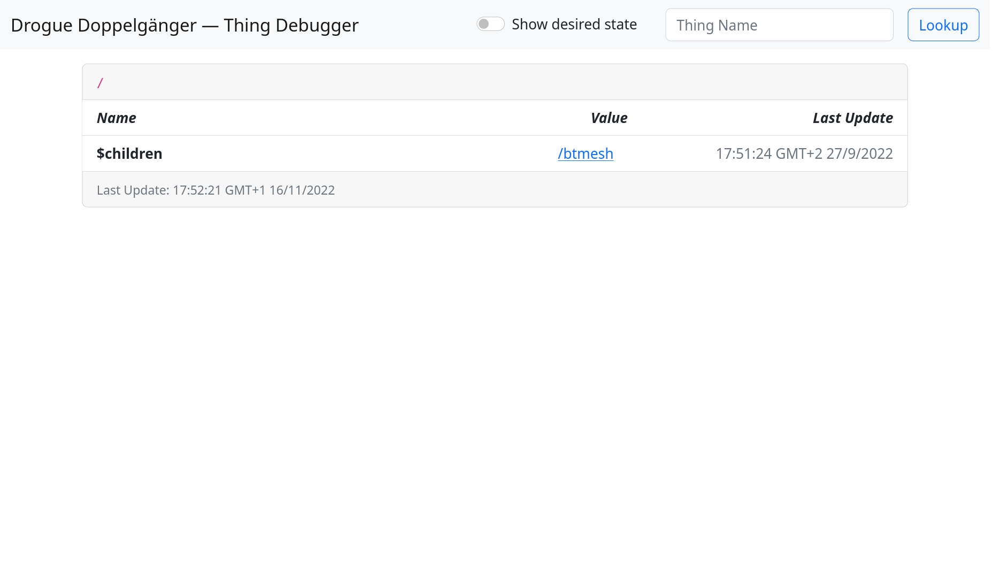
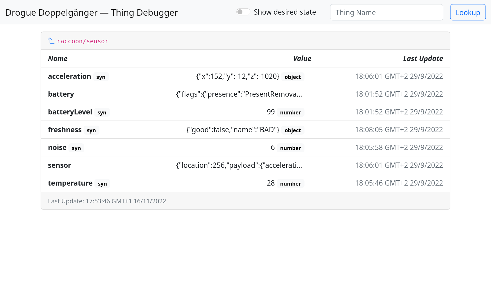
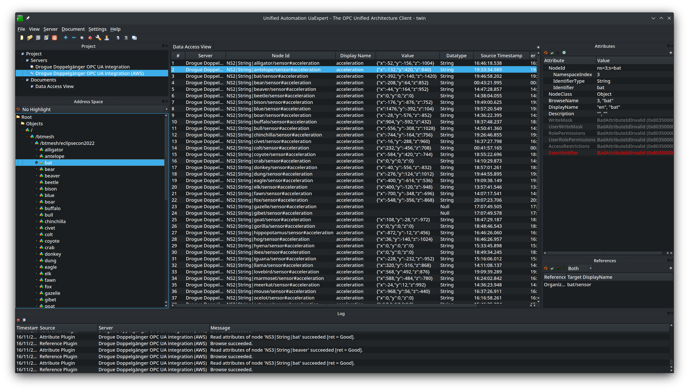
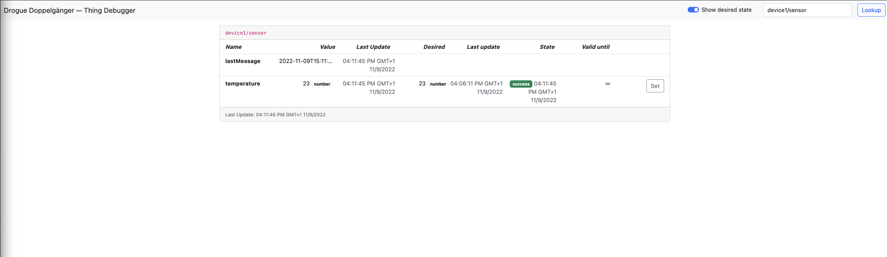

+++
title = "Drogue Cloud: Release 0.11.0"
extra.author = "ctron"
description = "Drogue Cloud 0.11.0 is mostly improving existing functionality, polishing what is already there."
+++

This release is another release with a focus on improving existing functionality. The reason for this is simple: it works just fine. True, there is always room for improvement, but also to build upon what is
there, so maybe, read on …

<!-- more -->

## TLS improvements

CoAP finally has support for DTLS. DTLS is a variant of TLS, but based on UDP, which is used by CoAP. The CoAP
endpoint originated from a Google Summer of Code project. But DTLS support was excluded, as this would have been too much for one summer. This has changed now, and the new release supports CoAP with DTLS.

When using CoAP with DTLS, it makes sense to also support TLS-PKS, which we so far didn't support. TLS-PKS uses
a simple "pre shared key", instead of a TLS session handshake and certificates. This speeds up establishing TLS
connections, and also reduces the work devices have to perform in order to connect to a TLS based services.
A feature which makes sense, which thinking about tiny devices, using CoAP.

With the new release, we do support TLS-PSK for all endpoints, not only CoAP, but for HTTP and MQTT too.

## Dependencies & Quality of life improvements

From a user perspective, it is hardly worth mentioning. But, quite some time went into updating
dependencies for this release. From the build system up to the frontend. Keycloak, Kafka, Kubernetes, but also
GitHub Actions Runners … everyone is updating something, and we did catch up.

And there are a bunch of minor improvements, like new UI features in the console, CORS support for the HTTP endpoint, more knobs in the Helm charts.

Bug fixes and performance improvements 😉

## More integration examples

Drogue Cloud doesn't require you to use any specific device or SDK. We want to make it easy for devices to
connect and communicate with the cloud, and not create another closed IoT ecosystem.

This is already possible, and just to show you "how", we added two more examples:

* https://github.com/drogue-iot/micropython-examples
* https://github.com/drogue-iot/arduino-examples

Both examples target microcontrollers, with existing, well known platforms (MicroPython and Arduino). As you
can see, it only takes a few lines to connect to the cloud side.

## Digital twin

So, if we didn't implement a bunch of new features in Drogue Cloud, what did we do instead (I mean aside from
[EclipseCon](https://twitter.com/lulf/status/1584248208015777792))?

Digital twin! We mentioned in the last release blog post that we needed some more time to think about it. And so we did.

Drogue Cloud is intended to normalize IoT connectivity.
[Drogue Doppelgänger](https://github.com/drogue-iot/drogue-doppelgaenger) is there to normalize IoT payload.
And once you've normalized payload, you also want to work with the data. And some tasks are just so common that
it makes sense to provide them out of the box. One might call that "IoT middleware", or "Digital Twin", as it
works with the mirrored state of the devices. The name of the project is
[Doppelgänger](https://en.wikipedia.org/wiki/Doppelg%C3%A4nger), and it mainly provides digital twin functionality.

The goals of Doppelgänger are:

* Work with any IoT connectivity layer: True, we focus on Drogue Cloud. But with a bit of code, it should easily be possible to attach it to e.g. a standard MQTT broker.
* Normalize IoT payload: The tricky part. As you never know what data you get, unless you adopt some existing schema. And this is what we aim for. We do have a simple internal data model, which should be able to support existing data models, like OPC UA. And like the connectivity layer, we provide a translation layer to convert data into the Doppelgänger thing model.
* Provide out of the box functionality to work with data: Renaming properties, transforming values, evaluating state, reconciling between desired and actual state, aggregating data, building thing relations.
* Provide APIs to the things state and configuration: not only our own APIs, but also support APIs like OPC UA or Web of Things.

So, if these are the goals, what is the current state of the project? We do have a 0.1 release. That sounds early, and it is. But it is the right time to check it out, and come up with your feedback 😉.

And just to make you a bit curious, here are a few features the 0.1 release already brings:

* IoT connectivity with Drogue Cloud
* Updating state from JSON messages
* State reconciliation with custom JavaScript code (based on state change, timers, or lifecycle events)
* State aggregation and a dynamic hierarchy using references
* Validation of the things state using a JSON Schema
* Reconciliation of desired state based on actual state (e.g. drive the actual state towards the desired state using commands, with re-try and scripts)
* Subscribing to the thing state using WebSocket and OPC UA

We do have a set of [example snippets](https://github.com/drogue-iot/drogue-doppelgaenger/tree/main/examples) which might show this in a more technical way.

<figure>

<figcaption>Root of the hierarchy in the debugger web application</figcaption>
</figure>

<figure>

<figcaption>A thing in the web debugger</figcaption>
</figure>

<figure>

<figcaption>The same hierarchy in an OPC UA client</figcaption>
</figure>

<figure>

<figcaption>A desired value sync in action</figcaption>
</figure>

And to give you a bit of context to the screenshots, this shows the web based debugger on a Doppelgänger instance we used for the IoT hackathon at EclipseCon 2022. The data came from micro:bits, through a Bluetooth Mesh network, connected via gateways to Drogue Cloud. The OPC UA twin integration shows the same data, just using OPC UA as the API instead of a simple WebSocket API.

## What's next

There are some bigger topics to tackle, presumably these are all tasks for 2023.

### Scale testing

We tested several aspects of the performance, but we never did a scale test to push the system to its limit.
And once we do, I am sure we will find something to fix.

So part of next year we will be looking into scale testing, in order to come up with some numbers, and
maybe some nice charts.

### Digital twin

We only got started with digital twin. It is a 0.1 release, and some basic tasks still need to be completed.
But we already have some ideas on what to do next:

* Supporting additional data models and APIs: [VSS](https://covesa.github.io/vehicle_signal_specification/), [Web of Things](https://www.w3.org/WoT/), [Asset Administration Shell](https://www.plattform-i40.de/IP/Redaktion/EN/Downloads/Publikation/Details_of_the_Asset_Administration_Shell_Part1_V3.html) come into our mind.
* Adding support for WebAssembly in addition to JavaScript code.
* Taking Doppelgänger to the Edge, running some workload on the edge, and building a hierarchy of twins.

There are so many possibilities, and we would encourage you to
[reach out to us](https://matrix.to/#/#drogue-iot:matrix.org), and let us know what is important for you. This helps us
prioritize, and gives you the opportunity to steer the project in a direction that helps you most.

But of course, contribution in the form of code is also very welcome 😉 

## Also see

* [Releases](https://github.com/drogue-iot/drogue-cloud/releases)
* [Public sandbox](https://sandbox.drogue.cloud)
* [Drogue Doppelgänger](https://github.com/drogue-iot/drogue-doppelgaenger)
