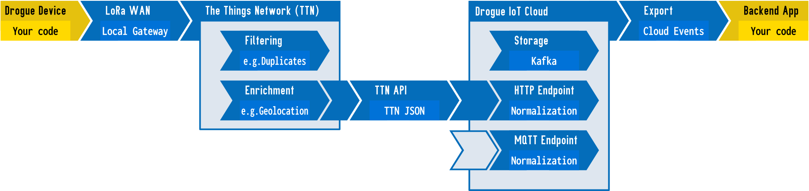
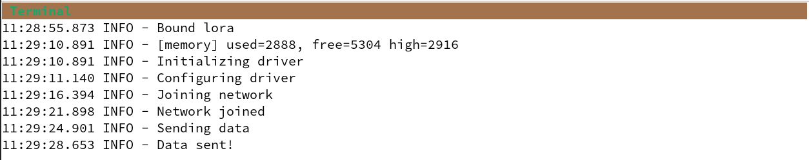
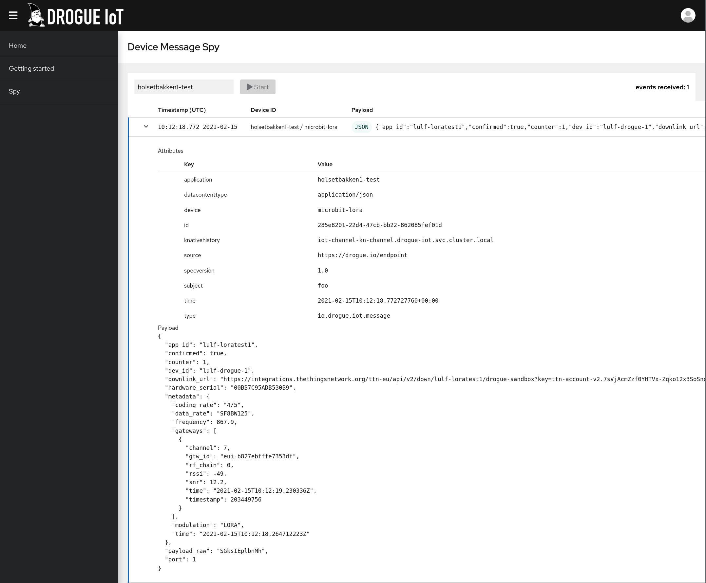

+++
title = "From drogue-device to drogue-cloud"
extra.author = "ulf_and_jens"
+++

In previous posts we've seen how to [run drogue-cloud](https://blog.drogue.io/the-cloud-side-of-things/), how to [use LoRaWAN in rust](https://blog.drogue.io/rust-and-lora/), and the introduction of the [drogue-device](https://blog.drogue.io/introducing-drogue-device/). In this post, we'll tie this together and walk through the process of running LoRa on drogue-device, sending data to drogue-cloud. 

<!-- more -->

# Recap

Let's have a quick look at the different technologies we will be focusing on in this post.  

## About LoRa

LoRa is a low power long range wireless protocol that operates in a lower frequency spectrum than WiFi, ZigBee and Bluetooth. This enables IoT use cases not possible with the shorter range technologies. We've [previously](https://blog.drogue.io/rust-and-lora/) seen how you can use LoRa with Rust. In this post, LoRa is only used as an example of one way to communicate from a drogue-device to drouge-cloud. We aim to support both WiFi, LoRa, NB-IoT and other wireless standards for working with drogue-cloud.

## About drogue-device

Drogue-device is an [Actor framework](https://en.wikipedia.org/wiki/Actor_model) for writing embedded applications in Rust. The advantage of using [drogue-device](https://github.com/drogue-iot/drogue-device) is that you can represent sensors and peripherals as independent components (actors) and wire them together in your application, as a way to apply good software engineering principles in embedded programming.

## Drogue Cloud

In many cases you might want to connect your devices to some central system. A system that may receive data, hand
out commands and configuration to devices, orchestrate firmware updates and lots more. That is Drogue Cloud, our backend
system based on [Kubernetes](https://kubernetes.io/), [Knative](https://knative.dev/), and [Cloud Events](https://cloudevents.io/).

[Drogue Cloud](https://github.com/drogue-iot/drogue-cloud) provides you with tools for device authentication and authorization,
different protocol endpoints, message normalization, persistence, device management, and a few more things. The idea is
that, on the cloud side, you can focus on processing the data that your devices provide you.

# Device drivers on drogue-device

Drogue-device contains device drivers for different boards and sensors. Drivers follow a common set of patterns that makes it easier to write new drivers. Device drivers can be written in different ways. The common patterns we've seen is:

* Writing a generic driver that consists of a hardware specific HAL that implements a HAL trait, and an actor that is templatized with the HAL trait as a type parameter. The actor is the API outwards to the embedded application and the drogue-device framework. 

* Writing a common set of commands that an Actor should support, and writing a hardware-specific driver that implements the request and notify handlers for the commands. This may be easier if a lot of the driver logic is hardware-specific, and there would be little gain in using a common HAL.

In both cases, a `Package` may be used to group multiple actors in a driver together and expose a single primary actor used to interact with the device.

For more information on writing drivers, see [the driver guide](https://github.com/drogue-iot/drogue-device/blob/master/DRIVERS.md).

In this example, we'll be using the [Rak811](https://github.com/drogue-iot/drogue-device/blob/master/src/driver/lora/rak811.rs) driver for LoRa, and the [nRF UART](https://github.com/drogue-iot/drogue-device/blob/master/src/driver/uart/dma.rs) driver. These are independent drivers, that are wired together using message passing. All interactions with the peripheral is done using the drivers _address_ that is configured during device initialization. The API for LoRa drivers can be found [here](https://github.com/drogue-iot/drogue-device/blob/master/src/driver/lora/mod.rs), and we plan to provide support for other LoRa drivers.

To send a message, the LoRa driver address is used:

```rust
   lora_driver_address.send(QoS::Confirmed, 1, b"Hello").await.expect("Error sending data");
```

Under the hood this will send a message to the LoRa driver which will initiate the transfer. Using Rust Async, the result can be await'ed, which in this case is required to ensure that the reference is kept valid for the lifetime of the request.

The full example of drogue-device can be found [here](https://github.com/drogue-iot/drogue-device/tree/master/examples/nrf/microbit-rak811).


# Telemetry to the cloud

When the device sends data to the cloud, it actually shouts out its message to the local airspace using the LoRa
protocol. If there is a LoRa gateway nearby, then it will take that message and forward that to its backend system.

In our case, we chose to use The Things Network (TTN), just because we had a bit of experience with them. And,
because they have a great and affordable indoor gateway and great support for many different types of gateways, which is
great for testing.

Once the message reached the backend system of TTN, it will get forwarded to our Drogue Cloud sandbox instance using
the HTTP integration of TTN. The following diagram shows the message flow in a bit more detail:



Don't be scared! Yes, this is a bit more complex than just sending your message to the cloud using WiFi. Let's take
a look at the different components in there.

* **Drogue Device** – This is your device, your code and your data you want to transmit.
* **LoRa gateway** – The LoRa gateway acts as the local entry point for LoRa devices to a TCP/IP network. Depending on
  the type of gateway, its antenna and location, it can cover quite an area, much larger than any WiFi could do. And, with
  less power requirements for the devices.
* **The Things Network** – TTN is a service provider, which takes on pre-processing LoRa messages received by their
  gateways. The good thing, you can put up a gateway yourself and add it to their network. Which also means, that you
  can re-use other gateways in their system. Another task that LoRa backend systems have to perform, is the detection
  of duplicates. Maybe there are multiple gateways in the vicinity of your device. Which also means that messages will
  also be received and forwarded by multiple gateways. While this is good for coverage and redundancy, you want to
  filter out duplicates as some point. TTN provides this service, and also allows to enrich the data with additional
  information.
* **Exporting messages** – We don't to process our data, and so we need to get the messages out of TTN. One of the
  options is to use the HTTP integration of TTN. In a nutshell, this will call a configured HTTP endpoint for each
  message received. Ideal for our Drogue IoT HTTP endpoint.
* **HTTP endpoint** – The Drogue Cloud HTTP endpoint will authenticate and authorize the remote peer. It also
  understands the specific API and JSON format of TTN, and converts this into a CloudEvents structure. Forwarding this
  to Knative and Kafka.
* **Backend app** – Your application, on the cloud side. The application which wants to process the data coming from
  your devices.

Why don't we directly consume from TTN? One of the core features of Drogue Cloud is to
integrate with all kinds of IoT related communication partners. Just assume you want to add an additional network like
Sigfox later on. Our you want to add some of your own gateways? Or add some devices using MQTT? In all those cases,
you would need to create some kind of data normalization layer yourself. If that is a dedicated layer, or a growing
`if/else` block in your code, doesn't matter. Drogue cloud provides that layer for you, and lets your application
consume all those messages using standardized CloudEvents.

Another question is: why don't we directly send to the Drogue Cloud instance? First, we will always need some kind of
gateway, to bridge between LoRaWAN and the TCP/IP world. We cloud create our own gateway stack, receive messages and
forward them directly to our endpoints. On the other hand, that would mean that we would need to do the LoRa specific
processing, like detecting duplicates, ourselves. Yes, some open source software exists for that as well. But, in any
case, we would need that functionality. For the sake of simplicity, we simply re-use an existing service for this.

Still, if you are interested in creating a direct integration, we would be happy to help you in the process.

# Preparing drogue-cloud

* Introducing drogue-cloud sandbox
* Creating application
* Device management

# Integrating TTN with drogue-cloud

* Setting up auth

In the TTN console, you can create an integration using several out of the box components. For drogue-cloud, we can use the generic HTTP Integration, which allows you to configure TTN to pass on telemetry data to a HTTP endpoint, in our case the Drogue IoT sandbox. The authorization header contains the HTTP basic auth credentials for our device. (NOTE: This is not really a good way of doing things, writing a proper integration that did not require storing credentials in TTN would be better).


Once the integration is set up, we are ready to send some data.


# Sending the data

* Opening drogue sandbox console
* Interacting with the device

To send the data, we flash the device using _cargo embed_. This will open the debug console for the device, so we can see what's going on:



The example is made for the BBC micro:bit attached to a RAK811 LoRa board over UART. To join the network, we push the 'A' button on the micro:bit. To send data, we push the 'B' button.

Once data is sent, the telemetry should find its way to the drogue console:



# Future work

* Summarize
* Device management integration
* Footprint of drogue-device
* Firmware upgrades
